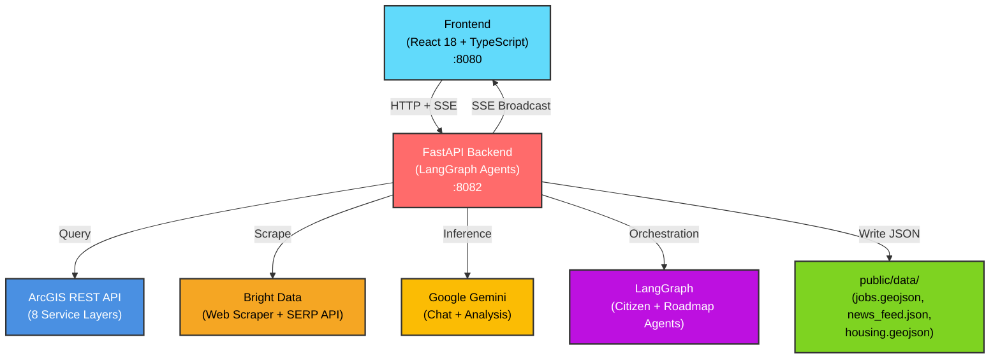
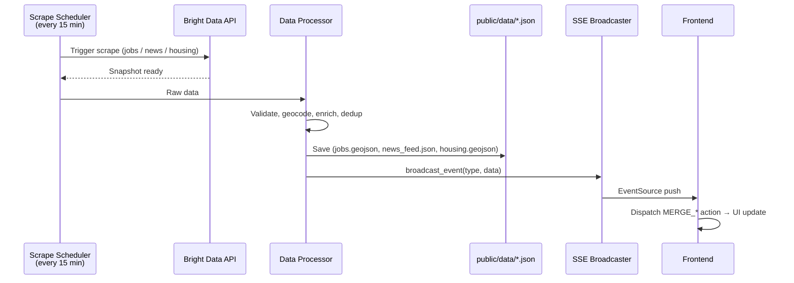

# MontgomeryAI Navigator

Civic navigator platform for Montgomery, Alabama residents. Access local services, job opportunities, community news, and personalized guidance through an AI-powered interface.


**Frontend:** React 18 · TypeScript · Vite · Tailwind CSS · shadcn/ui
**Backend:** FastAPI · Python · LangGraph Agents · Bright Data Pipelines
**Data:** ArcGIS REST API · Bright Data (Indeed, LinkedIn, Glassdoor, Google News, Zillow)
**AI:** Google Gemini · LangGraph Multi-Agent Workflows

## Features

- **Services Navigator** — Interactive map + directory of 8 service categories with ArcGIS data, personalized roadmaps
- **News & Sentiment** — Community news feed with reactions, comments, misinfo detection, and AI sentiment analysis
- **Career Growth** — Job matching against uploaded CV, commute analysis, trending skills, market pulse
- **Citizen Chat** — AI-powered assistant drawing from city data, services, and community knowledge
- **Admin Dashboard** — AI insights, comment analysis, mayor's brief, predictive hotspot heatmap

## System Architecture



## Data Pipeline



**Streams:** Jobs (Indeed + LinkedIn + Glassdoor), News (22 Google News queries), Housing (Zillow), Benefits (Alabama gov sites)

## API Reference

| Method | Endpoint | Purpose | Auth |
|--------|----------|---------|------|
| `GET` | `/health` | Health check and stream status | — |
| `GET` | `/api/stream` | SSE stream for live data (jobs, news, housing) | — |
| `POST` | `/api/analysis/run` | Trigger sentiment analysis job | — |
| `GET` | `/api/analysis/status` | Check analysis job status | — |
| `GET` | `/api/analysis/results` | Retrieve analysis results | — |
| `GET` | `/api/predictions/hotspots` | Predictive complaint hotspots | — |
| `GET` | `/api/predictions/trends` | Category trend analysis | — |
| `POST` | `/api/chat` | Mayor Chat (SSE streaming) | — |
| `POST` | `/api/citizen-chat` | Citizen AI assistant | — |
| `GET` | `/api/comments` | Fetch news comments | — |
| `POST` | `/api/comments` | Post a comment | — |
| `POST` | `/api/roadmap/generate` | Generate personalized service roadmap | — |
| `POST` | `/api/webhook/jobs` | Ingest job data from Bright Data | Secret |
| `POST` | `/api/webhook/news` | Ingest news data from Bright Data | Secret |
| `POST` | `/api/webhook/housing` | Ingest housing data from Bright Data | Secret |

## Quick Start

### Prerequisites

- Node.js 18+
- Python 3.11+
- [uv](https://docs.astral.sh/uv/) (Python package manager)

### Frontend

```bash
cd frontend
npm install
npm run dev          # http://localhost:8080
```

### Backend

```bash
# From project root
uv sync
uvicorn backend.api.main:app --reload --port 8082
```

### Environment

Copy `.env.example` to `.env` and fill in:

```env
BRIGHTDATA_API_KEY=your_key_here
GEMINI_API_KEY=your_key_here
```

### Verify

```bash
curl http://localhost:8082/health
# → {"status":"ok","streams":["jobs","news","housing","benefits"]}
```

## Project Structure

```
Pegasus/
├── frontend/                    React 18 + TypeScript + Vite
│   ├── src/
│   │   ├── components/app/      Feature components by domain
│   │   │   ├── cv/              Career Growth (16 files)
│   │   │   ├── services/        Services Navigator (19 files)
│   │   │   ├── news/            News Feed (25 files)
│   │   │   ├── admin/           Admin Dashboard (20 files)
│   │   │   └── cards/           Shared cards (7 files)
│   │   ├── components/ui/       shadcn/ui primitives
│   │   ├── lib/                 Business logic, services, types
│   │   │   ├── context/         State reducer (7 slices)
│   │   │   ├── types/           TypeScript interfaces (12 files)
│   │   │   └── misinfo/         Misinformation scoring
│   │   └── pages/               Route-level components
│   └── public/data/             Static JSON/GeoJSON data
│
├── backend/                     FastAPI + Python
│   ├── api/                     Routers, schemas, deps, SSE
│   ├── chatbot/                 Intent classification + response (22 modules)
│   ├── agents/                  LangGraph citizen + roadmap agents
│   │   └── citizen/tools/       Agent tools (service lookup, data)
│   ├── processors/              Job, news, housing data pipelines
│   ├── predictive/              Hotspot scoring, trend analysis
│   ├── core/                    Bright Data client, scheduler, SSE, sentiment
│   ├── triggers/                Scrape trigger scripts
│   └── tests/                   pytest test suite
│
├── docs/                        Documentation + helper prompts
├── .env.example                 Environment template
└── pyproject.toml               Python dependencies
```

## Module Documentation

- **[API Layer](./backend/api/README.md)** — Routers, schemas, auth, error handling
- **[Chatbot](./backend/chatbot/README.md)** — Intent classification, retrieval, response generation (22 modules)
- **[Agents](./backend/agents/README.md)** — LangGraph citizen agent, roadmap agent, tools
- **[Processors](./backend/processors/README.md)** — Job/news/housing data pipelines
- **[Core](./backend/core/README.md)** — Bright Data client, scheduler, SSE broadcaster, sentiment rules
- **[Predictive](./backend/predictive/README.md)** — Hotspot scoring, trend analysis
- **[Frontend Lib](./frontend/src/lib/README.md)** — State management, services, types
- **[Frontend Components](./frontend/src/components/app/README.md)** — UI component architecture

## Running Tests

```bash
# Frontend (Vitest) — 140+ tests
cd frontend && npx vitest run

# Backend (pytest)
cd .. && python -m pytest backend/tests/ -v
```

## Code Standards

- **File limit:** 150 lines (split if exceeded)
- **Function limit:** 30 lines (extract helpers)
- **Type hints:** Required on all arguments and returns
- **Naming:** Verb phrases for functions (`get_user_by_email`, not `fetch`)
- **Commits:** `feat|fix|refactor|test|docs(scope): description`

See [docs/CLAUDE.md](./docs/CLAUDE.md) for full guidelines.

## Hackathon

| Field | Detail |
|-------|--------|
| **Event** | World Wide Vibes Hackathon (WWV Mar 2026) |
| **Organizer** | GenAI.Works Academy |
| **Deadline** | March 9, 2026 |
| **Prize Pool** | $5,000 |
| **Bonus Points** | Bright Data integration (4 data streams, webhooks, scheduler) |

---

Built for Montgomery, Alabama residents. Part of the World Wide Vibes Hackathon 2026.
