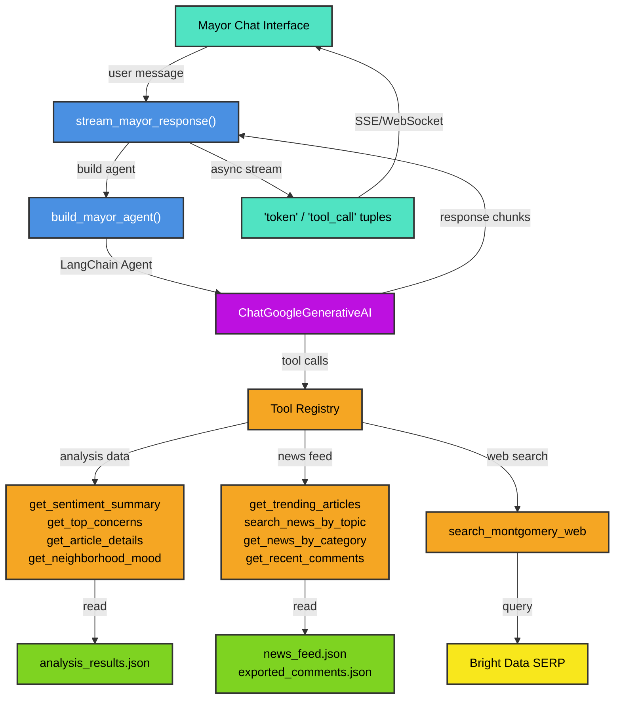

# Agents Module

Conversational AI layer for the Mayor of Montgomery to query civic sentiment data and news with streaming responses.

## Overview

The agents module provides a **LangChain-based mayor chat agent** that answers questions about citizen sentiment, trending articles, comments, and local news. The agent is powered by Gemini 3.1 Flash Lite and equipped with read-only tools that query two data sources:

1. **Analysis Results** — pre-computed sentiment analysis of articles and comments
2. **News Feed** — live articles, comments, and engagement metrics
3. **Web Search** — Montgomery-specific external news via Bright Data SERP

The agent streams responses as tokens and tool invocations, enabling real-time UI feedback.

## Architecture



## Files

| File | Purpose |
|------|---------|
| **mayor_chat.py** | Agent builder, streaming orchestrator, message formatting |
| **prompts.py** | System prompts for batch analysis and mayor chat agent |
| **tools/registry.py** | LangChain @tool wrappers and TOOLS list for agent discovery |
| **tools/analysis_tools.py** | Read functions for sentiment analysis results (analysis_results.json) |
| **tools/news_tools.py** | Read functions for news feed and comments (news_feed.json, exported_comments.json) |
| **tools/web_search_tool.py** | Web search wrapper for Montgomery-specific external queries |

## Key Usage

### Agent Creation
```python
from backend.agents.mayor_chat import build_mayor_agent

agent = build_mayor_agent()
# agent is a LangChain Runnable with .astream() and .invoke()
```

### Streaming Responses
```python
from backend.agents.mayor_chat import stream_mayor_response

chat_history = [{"role": "user", "content": "How's downtown feeling?"}, ...]
user_message = "What's the sentiment on road safety?"

async for event_type, data in stream_mayor_response(user_message, chat_history):
    if event_type == "token":
        print(f"Text: {data}")  # AI response text
    elif event_type == "tool_call":
        print(f"Tool: {data}")  # Tool name being invoked
```

### Agent Prompt Rules
The `MAYOR_CHAT_PROMPT` enforces strict behavior:
- **Always call a tool before responding** — never answer from memory
- **Always call get_recent_comments first** when asked about comments/feedback
- **Output only bullets** — no paragraphs, no padding
- **Always end with recommendations** in `:::recommendations` block format
- Each recommendation must cite a comment count or percentage

## Data Formats

### Analysis Results (analysis_results.json)
```json
{
  "analyzed_at": "2026-03-07T10:30:00Z",
  "articles": [
    {
      "article_id": "article-1",
      "article_sentiment": "negative",
      "article_confidence": 0.85,
      "admin_summary": "Downtown parking enforcement too aggressive",
      "topic_clusters": ["parking", "enforcement"],
      "urgent_concerns": ["meter enforcement complaints"],
      "comments": [
        {
          "sentiment": "negative",
          "confidence": 0.92,
          "topics": ["parking"],
          "flagged": false
        }
      ],
      "recommendations": [
        {
          "priority": "high",
          "action": "Review meter enforcement policy",
          "rationale": "4 of 8 comments cite aggressive meters"
        }
      ]
    }
  ]
}
```

### News Feed (news_feed.json)
```json
{
  "articles": [
    {
      "id": "article-1",
      "title": "Downtown Parking Overhaul Draws Mixed Reviews",
      "category": "infrastructure",
      "sentiment": "negative",
      "location": {"neighborhood": "Downtown"},
      "upvotes": 12,
      "downvotes": 5,
      "commentCount": 8
    }
  ],
  "comments": [
    {
      "id": "comment-1",
      "articleId": "article-1",
      "content": "Parking meters are out of control...",
      "createdAt": "2026-03-07T09:15:00Z"
    }
  ]
}
```

## Model & Config

- **LLM:** Gemini 3.1 Flash Lite Preview
- **Temperature:** 0.3 (factual, minimal hallucination)
- **Max Tokens:** 4096
- **Stream Mode:** "updates" (LangChain updates dict)

## Error Handling

- Missing data files → tools return "No data available" messages
- Web search failures → logged and returned as unavailable
- Article/comment lookups → resolve by ID or fuzzy title match
- Tool invocation errors → propagate to agent for response handling

## Dependencies

- `langchain-core` — agent runtime, message types, tool decorators
- `langchain` — create_agent function
- `langchain-google-genai` — ChatGoogleGenerativeAI model
- `backend.config` — REPO_ROOT path resolution
- `backend.core.bright_data_client` — SERP search integration

## Notes

- **Tools are read-only** — no write/delete operations
- **Neighborhood filtering** is case-insensitive
- **Comment deduplication** happens in news_tools._load_comments()
- **Web search automatically appends "Montgomery Alabama"** for geo-scoping
- **Tool names are LangChain @tool decorated functions** — agent sees them as JSON schema for function calling
