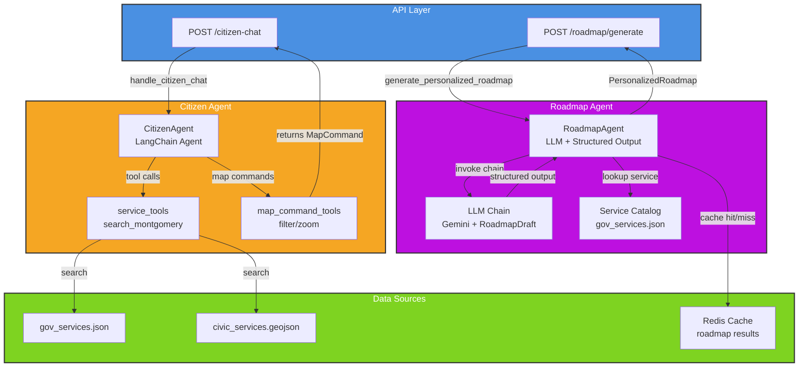

# AI Agents Module

The agents module provides LangChain-based conversational AI for civic service discovery, personalized roadmap generation, and predictive civic analytics. Two main agents serve the Pegasus platform: **CitizenAgent** (real-time service lookup) and **RoadmapAgent** (personalized step-by-step guidance).

---

## Architecture Overview



**Key Components:**
- **CitizenAgent**: Reactive question answering with tool calling (web search, map commands)
- **RoadmapAgent**: Proactive step-by-step guidance generation with caching
- **Data Sources**: Static civic and government service catalogs in public data directory
- **API Layer**: FastAPI routers delegating to agent functions

---

## Citizen Agent Flow

The CitizenAgent is a **LangChain Agent** that processes user questions in real time, searches for services, and returns structured responses with map interactivity.

```mermaid
sequenceDiagram
    participant User as Frontend
    participant API as citizen_chat.py
    participant Agent as CitizenAgent
    participant Search as search_montgomery
    participant Map as map_command_tools
    participant Data as civic/gov data
    participant LLM as LLM

    User ->> API: POST /citizen-chat<br/>message + conversation_id
    API ->> Agent: handle_citizen_chat(message)
    Agent ->> Agent: load history for conversation_id
    Agent ->> LLM: Invoke with prompt + tools
    LLM ->> Agent: ToolCall(search_montgomery, query)
    Agent ->> Search: search_montgomery(query)
    Search ->> Data: search civic_services.geojson
    Search ->> Data: search gov_services.json
    Data -->> Search: matching services
    Search -->> Agent: formatted results
    LLM ->> Agent: ToolCall(filter_map_category, cat)
    Agent ->> Map: filter_map_category(category)
    Map -->> Agent: MapCommand JSON
    LLM ->> Agent: CitizenAgentResponse<br/>answer + services + chips
    Agent ->> Agent: extract map commands from messages
    Agent ->> Agent: assemble response with sources/chips
    Agent -->> API: response dict
    API -->> User: JSON response<br/>answer + source_items + map_commands

    style User fill:#50E3C2
    style API fill:#4A90E2
    style Agent fill:#F5A623
    style LLM fill:#BD10E0
```

**Flow Summary:**
1. Frontend sends user question with optional conversation ID
2. Agent loads conversation history (last 6 messages)
3. LLM decides which tool to call: `search_montgomery` or map commands
4. Search tool queries civic and gov service catalogs
5. LLM structures response with answer, service cards, and follow-up chips
6. Map commands are extracted and returned for frontend rendering
7. History is trimmed and saved for context in next turn

**Key Design Patterns:**
- **Single Tool Call Per Turn**: Prompt enforces one search maximum (speed optimization)
- **Structured Output**: Pydantic `CitizenAgentResponse` ensures consistent JSON
- **Conversation Memory**: Per-conversation history limited to 6 turns to prevent unbounded growth
- **Map Integration**: Tool results are parsed for `MapCommand` JSON to update the civic services map

---

## Roadmap Generation Flow

The RoadmapAgent transforms service documentation into personalized step-by-step guidance. It uses an LLM chain with structured output and Redis caching for performance.

```mermaid
sequenceDiagram
    participant Frontend as Frontend
    participant API as roadmap.py
    participant Agent as RoadmapAgent
    participant Cache as Redis
    participant LLM as LLM Chain
    participant Catalog as gov_services.json
    participant Output as PersonalizedRoadmap

    Frontend ->> API: POST /roadmap/generate<br/>service_id + optional citizen
    API ->> Agent: generate_personalized_roadmap(service_id, citizen)
    Agent ->> Agent: build cache key<br/>service_id + citizen hash
    Agent ->> Cache: fetch(cache_key)
    alt Cache Hit
        Cache -->> Agent: cached PersonalizedRoadmap
        Agent -->> API: return cached
    else Cache Miss
        Agent ->> Catalog: _get_service(service_id)
        Catalog -->> Agent: service guide dict
        Agent ->> Agent: _build_prompt(citizen, guide)
        Agent ->> LLM: invoke chain with prompt
        LLM ->> LLM: synthesize RoadmapDraft<br/>with steps + eligibility_note
        LLM -->> Agent: RoadmapDraft
        Agent ->> Agent: _build_roadmap_model(draft, guide)
        Agent ->> Agent: convert to PersonalizedRoadmap<br/>with RoadmapStep objects
        Agent ->> Cache: store(cache_key, roadmap, ttl=86400)
        Cache -->> Agent: stored
    end
    Agent -->> API: PersonalizedRoadmap
    API -->> Output: response_model serialization
    Output -->> Frontend: JSON roadmap with steps

    style Frontend fill:#50E3C2
    style API fill:#4A90E2
    style Agent fill:#BD10E0
    style LLM fill:#F5A623
    style Cache fill:#7ED321
```

**Flow Summary:**
1. Frontend sends service ID and optional citizen profile
2. Agent builds cache key (service + citizen hash)
3. Cache hit returns pre-computed roadmap; miss proceeds to generation
4. Service guide is loaded from catalog
5. Prompt is built (generic or personalized based on citizen profile)
6. LLM chain synthesizes `RoadmapDraft` with steps and eligibility note
7. Draft is converted to `PersonalizedRoadmap` with full step details
8. Result is cached with 24-hour TTL and returned to frontend

**Cache Strategy:**
- **Generic roadmaps**: `roadmap:generic:{service_id}`
- **Personalized roadmaps**: `roadmap:personalized:{service_id}:{citizen_hash}` (different for each citizen)
- **TTL**: 24 hours (configurable via `ROADMAP_CACHE_TTL` environment variable)
- **Fallback**: If LLM fails, `_build_fallback_steps()` generates basic steps from raw service data

---

## Tool Registry

### Citizen Agent Tools

| Tool | Description | Data Source | Returns |
|------|-------------|-------------|---------|
| **search_montgomery** | Search for civic services by name, category, keyword in Montgomery AL | `civic_services.geojson`<br/>`gov_services.json` | Formatted text results with details (name, address, phone, hours, programs, eligibility, how-to-apply) |
| **filter_map_category** | Show all services in a single category on the civic map | Static category list | `MapCommand` JSON with `type: "filter_category"` |
| **zoom_to_location** | Zoom map to a specific latitude/longitude with a label | N/A (LLM provides coords) | `MapCommand` JSON with `type: "zoom_to"` |

**Tool Implementation:**
- See: `backend/agents/citizen/tools/registry.py:12-46`
- Service data helpers: `backend/agents/citizen/tools/service_data.py`
- Map command JSON: `backend/agents/citizen/tools/map_command_tools.py`

### Roadmap Agent Chain

| Component | Description | Input | Output |
|-----------|-------------|-------|--------|
| **LLM Chain** | ChatPromptTemplate + Gemini LLM with structured output | Service guide + optional citizen profile | `RoadmapDraft` (steps, eligibility_note, total_estimated_time) |
| **Service Loader** | Reads `gov_services.json` with LRU caching | service_id | Full service guide dict (title, description, eligibility, how_to_apply, documents_needed, income_limits) |
| **Prompt Builder** | Formats guide + optional citizen summary for LLM | Guide + citizen (or None) | Human-readable prompt with all context |
| **Cache Layer** | Redis-backed fetch/store with TTL | cache_key | Serialized roadmap or None (miss) |

**Implementation:**
- See: `backend/agents/roadmap_agent.py:243-273`

---

## Data Structures

### CitizenAgentResponse

```python
class CitizenAgentResponse(BaseModel):
    answer: str  # Markdown-formatted conversational reply
    services: list[ServiceItem]  # Structured service cards
    chips: list[str]  # 2-3 follow-up suggestions (under 8 words)
```

**ServiceItem Fields:**
- `title`: Service or organization name
- `description`: Brief description of what they offer
- `category`: Service category (health, childcare, education, etc.)
- `phone`, `address`, `url`, `hours`: Contact and access info
- `wait_time`: Expected processing time
- `what_to_bring`: List of required documents/items
- `programs`: Specific programs offered

See: `backend/agents/citizen/schemas.py:6-50`

### PersonalizedRoadmap

```python
class PersonalizedRoadmap(BaseModel):
    id: str  # Unique roadmap ID
    service_id: str  # Reference to gov_services.json entry
    service_title: str  # Human-readable service name
    service_category: str  # Category from service catalog
    eligibility_note: str  # Summary of who qualifies
    total_estimated_time: str  # "2-3 weeks", "1-2 hours", etc.
    steps: list[RoadmapStep]  # Step-by-step guidance
    generated_at: str  # ISO timestamp
```

**RoadmapStep Fields:**
- `step_number`: Sequential order (1, 2, 3...)
- `title`: Action-oriented title ("Confirm Eligibility", "Gather Documents")
- `action`: Plain-English description of what to do
- `documents`: List of documents needed for this step
- `location`: Physical address + hours (if in-person)
- `estimated_time`: How long this step takes ("5 minutes", "1-3 days")
- `pro_tip`: Helpful context or common pitfalls
- `can_do_online`: Boolean whether step can be completed online
- `online_url`: URL for online completion if available

See: `backend/api/schemas/roadmap_schemas.py`

---

## Usage

### Citizen Chat Endpoint

```bash
POST /citizen-chat
Content-Type: application/json

{
  "message": "Where can I apply for Medicaid in Montgomery?",
  "conversation_id": "user-123-session-abc"
}
```

**Response:**
```json
{
  "intent": "find_service",
  "answer": "**Medicaid** is available through the Alabama Department of Human Resources. Call **334-242-1234** or apply online at **dhr.alabama.gov**.",
  "confidence": 0.95,
  "source_items": [
    {
      "title": "Alabama DHR Medicaid",
      "description": "Health insurance for low-income residents",
      "category": "health",
      "phone": "334-242-1234",
      "address": "Montgomery, AL",
      "url": "https://dhr.alabama.gov"
    }
  ],
  "chips": ["Show me on the map", "What documents do I need?", "How do I apply?"],
  "map_commands": [
    {
      "type": "filter_category",
      "category": "health",
      "id": "..."
    }
  ]
}
```

### Roadmap Generation Endpoint

```bash
POST /roadmap/generate
Content-Type: application/json

{
  "service_id": "medicaid_alabamadhr",
  "citizen": {
    "id": "citizen-456",
    "persona": "Single parent",
    "tagline": "Needs childcare support",
    "goals": ["Get childcare subsidy", "Return to work"],
    "barriers": ["No car", "Limited income"],
    "civic_data": {
      "zip": "36104",
      "household_size": 2,
      "income": 1200,
      "income_source": "Part-time work",
      "children": 1,
      "children_ages": [3],
      "has_vehicle": false,
      "primary_transport": "Bus"
    }
  }
}
```

**Response:**
```json
{
  "id": "roadmap-medicaid_alabamadhr-citizen-456-1710000000",
  "service_id": "medicaid_alabamadhr",
  "service_title": "Alabama Medicaid",
  "service_category": "health",
  "eligibility_note": "As a single parent with monthly income below $1,500 and a child under 5, you likely qualify for Alabama Medicaid.",
  "total_estimated_time": "1-2 weeks",
  "steps": [
    {
      "step_number": 1,
      "title": "Confirm Eligibility",
      "action": "Call the Alabama DHR Medicaid office to confirm your household qualifies based on income and family size.",
      "documents": ["Pay stubs", "Proof of residence"],
      "location": {
        "name": "Alabama DHR",
        "address": "Montgomery, AL",
        "phone": "334-242-1234"
      },
      "estimated_time": "15 minutes",
      "can_do_online": true,
      "online_url": "https://dhr.alabama.gov/medicaid-apply"
    },
    {
      "step_number": 2,
      "title": "Gather Documents",
      "action": "Collect recent pay stubs, proof of residence, and identification.",
      "documents": ["Pay stubs", "Utility bill", "ID"],
      "estimated_time": "30 minutes",
      "can_do_online": false
    },
    {
      "step_number": 3,
      "title": "Submit Application",
      "action": "Apply online or in-person with your documents. In-person at the DHR office typically has shorter processing time.",
      "estimated_time": "1-2 weeks processing",
      "can_do_online": true,
      "online_url": "https://dhr.alabama.gov/medicaid-apply"
    }
  ],
  "generated_at": "2026-03-08T10:30:00+00:00"
}
```

---

## Configuration & Environment

| Variable | Default | Purpose |
|----------|---------|---------|
| `ROADMAP_CACHE_TTL` | `86400` (24 hours) | How long personalized roadmaps stay cached in Redis |
| `GOOGLE_API_KEY` | Required | Enables `build_llm()` to create Gemini LLM instances via `langchain_google_genai` |
| `REPO_ROOT` | Project root | Path to locate data files (`frontend/public/data/`) |

**LLM Configuration:**
- See: `backend/agents/common/llm.py` for model selection and temperature tuning
- Default: Gemini-based LLM via `build_llm()`
- Roadmap agent uses: `temperature=0.1, max_tokens=4096` (low temperature for deterministic output)

---

## File Structure

```
backend/agents/
├── README.md (this file)
├── __init__.py
├── citizen/
│   ├── agent.py              # CitizenAgent build + invoke logic
│   ├── prompt.py             # System prompt for civic Q&A
│   ├── schemas.py            # CitizenAgentResponse, ServiceItem
│   └── tools/
│       ├── registry.py       # LangChain tool definitions
│       ├── service_tools.py  # search_all() unified search
│       ├── service_data.py   # Data loading + formatting helpers
│       ├── map_command_tools.py  # MapCommand JSON generation
│       └── __init__.py
├── roadmap_agent.py          # RoadmapAgent + roadmap generation pipeline
├── common/
│   ├── llm.py                # build_llm() factory
│   └── web_search.py         # search_montgomery_web() implementation
├── mayor/                    # Mayor agent (predictive + analytics)
├── tools/                    # Shared tools (web search, analysis)
└── prompts.py                # Shared prompt templates
```

---

## Testing & Validation

### Citizen Agent
- **Tested with**: Real conversation history with various queries ("Where's the library?", "Apply for WIC", "Show me childcare")
- **Tool accuracy**: Web search results validated against civic_services.geojson and gov_services.json
- **Response consistency**: MapCommand JSON validated on frontend

### Roadmap Agent
- **Cache validation**: Redis cache hit verified with `cache.fetch()` and model deserialization
- **Fallback handling**: If LLM fails, steps are generated from raw service data
- **Prompt quality**: LLM receives formatted guides with all eligibility + application details

**Known Limitations:**
- Citizen agent makes exactly one tool call per turn (no multi-step reasoning)
- Roadmap agent requires service_id to match entry in gov_services.json
- Cache key for personalized roadmaps depends on deterministic citizen serialization

---

## Related Documentation

- **Service Data**: `frontend/public/data/README.md` — civic_services.geojson and gov_services.json schema
- **API Schemas**: `backend/api/schemas/roadmap_schemas.py` — Full Pydantic model definitions
- **Frontend Integration**: See citizen_chat.ts and RoadmapView.tsx for response handling
- **Roadmap Caching**: `backend/core/redis_client.py` — Cache client implementation

---

## Quick Debug Checklist

1. **Agent not responding?** Check `backend/agents/common/llm.py` — ensure LLM is built with correct API key
2. **Search results empty?** Verify data files exist: `frontend/public/data/civic_services.geojson` and `gov_services.json`
3. **Map commands not showing?** Check that tool result is valid JSON with `type` in (filter_category, zoom_to, highlight_hotspots, clear)
4. **Roadmap generation slow?** Check Redis connection and cache TTL — cache miss = 10-30s LLM latency
5. **History growing unbounded?** Verify `MAX_HISTORY_TURNS = 6` and conversation trimming logic in `agent.py:65-66`
