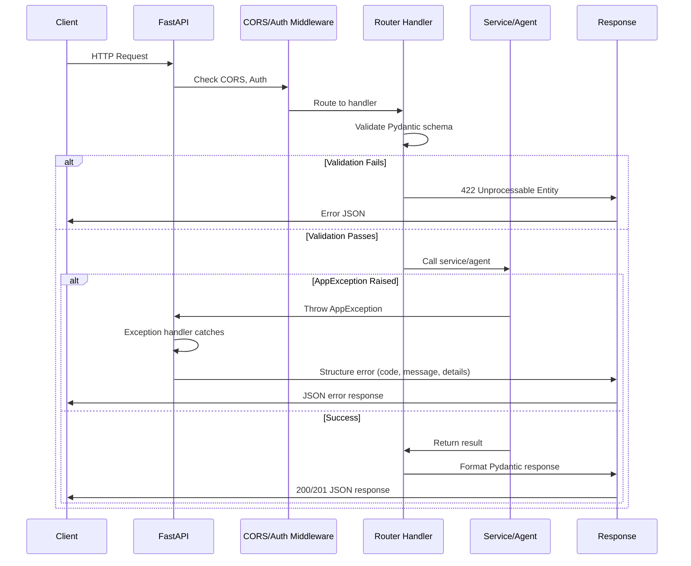
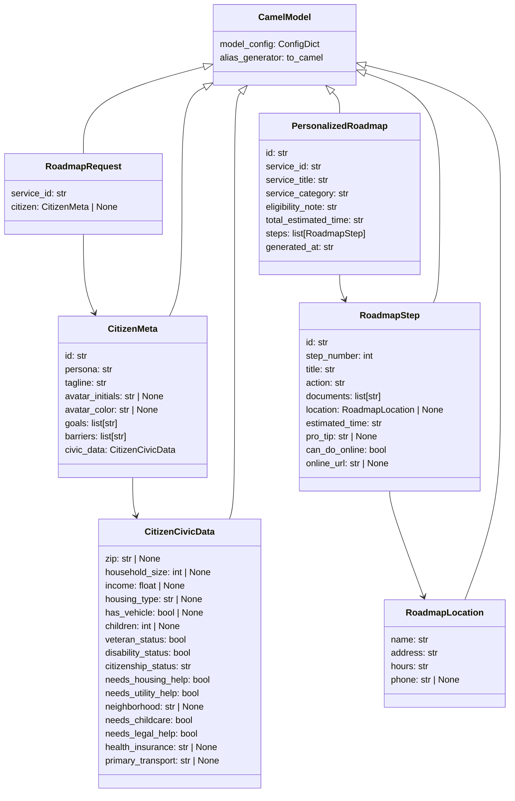
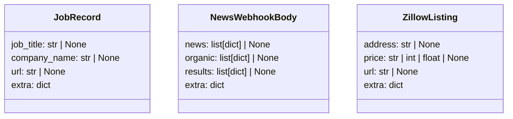
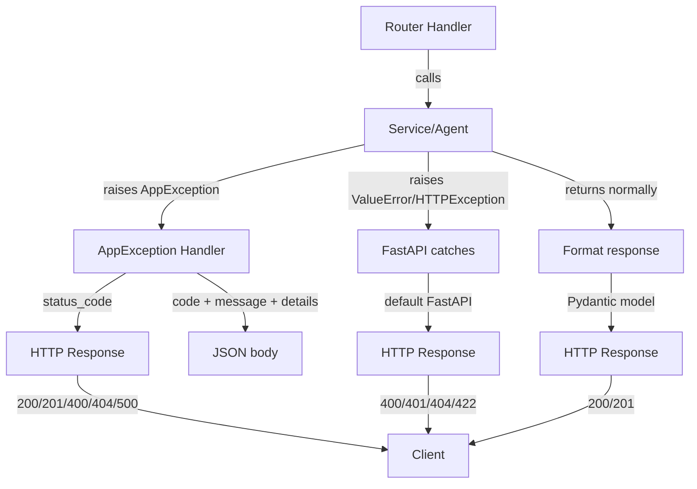
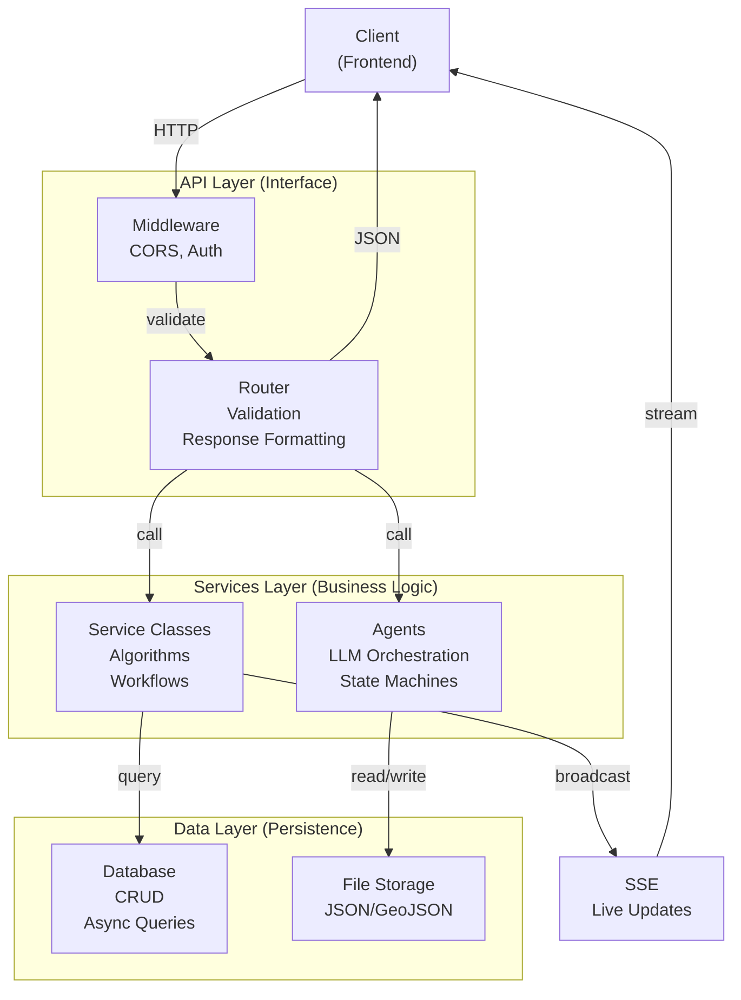

# API Layer Documentation

The API layer is the HTTP interface for MontgomeryAI. It handles request routing, validation, error handling, and response formatting. No business logic lives here—it delegates to services and agents in the backend.

**Location**: `backend/api/`

## Overview

The API is built with **FastAPI** and organized into:

- **main.py** — App initialization, middleware, exception handling, lifespan hooks
- **deps.py** — Shared dependencies (auth, validation)
- **routers/** — Endpoint modules (one router per feature domain)
- **schemas/** — Pydantic request/response models

### Core Principles

1. **Validation Only** — All Pydantic schemas validate input; API logic is zero
2. **No Business Logic** — Services and agents own algorithms and decisions
3. **Error Boundary** — AppException handler centralizes error responses
4. **Async-First** — All endpoints are async; background tasks for long-running work

---

## Request Flow



### Request Lifecycle

1. **Client Request** → FastAPI receives HTTP request
2. **CORS Middleware** → Checks `Allow-Origin` (localhost:3000, 5173, 8080–8082)
3. **Routing** → Router matches endpoint handler
4. **Pydantic Validation** → Schemas validate request body/params
5. **Service Call** → Handler invokes business logic
6. **Exception Handling** → AppException caught, formatted as JSON
7. **Response** → Handler returns Pydantic model or StreamingResponse
8. **Client Response** → HTTP response with status code + body

### Lifespan Hooks

On **server startup**:
- Environment checked for `AUTO_SCRAPE=1` and `BRIGHTDATA_API_KEY`
- If both present, background scraping scheduler starts

On **server shutdown**:
- Background tasks cancelled gracefully

See `main.py:19-33` for implementation.

---

## Routers & Endpoints

### Router Map

```mermaid
graph TD
    API["FastAPI App<br/>main.py"]

    API -->|prefix /api| ANALYSIS["analysis.py"]
    API -->|prefix /api| CHAT["chat.py"]
    API -->|prefix /api| CITIZEN["citizen_chat.py"]
    API -->|prefix /api| COMMENTS["comments.py"]
    API -->|prefix /api| ROADMAP["roadmap.py"]
    API -->|prefix /api| STREAM["stream.py"]
    API -->|prefix /api| WEBHOOKS["webhooks.py"]

    ANALYSIS --> ANALYSIS_RUN["POST /analysis/run"]
    ANALYSIS --> ANALYSIS_RESULTS["GET /analysis/results"]
    ANALYSIS --> ANALYSIS_STATUS["GET /analysis/status"]

    CHAT --> CHAT_POST["POST /chat"]

    CITIZEN --> CITIZEN_CHAT["POST /citizen-chat"]
    CITIZEN --> HOTSPOTS["GET /predictions/hotspots"]
    CITIZEN --> TRENDS["GET /predictions/trends"]

    COMMENTS --> COMMENTS_GET["GET /comments"]
    COMMENTS --> COMMENTS_POST["POST /comments"]

    ROADMAP --> ROADMAP_GEN["POST /roadmap/generate"]

    STREAM --> STREAM_GET["GET /stream"]

    WEBHOOKS --> WEBHOOK_JOBS["POST /webhook/jobs"]
    WEBHOOKS --> WEBHOOK_NEWS["POST /webhook/news"]
    WEBHOOKS --> WEBHOOK_HOUSING["POST /webhook/housing"]
```



### Endpoint Reference

| Method | Path | Auth | Description |
|--------|------|------|-------------|
| POST | `/api/analysis/run` | — | Trigger batch comment analysis |
| GET | `/api/analysis/results` | — | Fetch latest analysis results |
| GET | `/api/analysis/status` | — | Get analysis pipeline status |
| POST | `/api/chat` | — | Stream mayor chat response (SSE) |
| POST | `/api/citizen-chat` | — | Civic chatbot query |
| GET | `/api/predictions/hotspots` | — | Civic complaint hotspot predictions |
| GET | `/api/predictions/trends` | — | Civic complaint trend analysis |
| GET | `/api/comments` | — | List seed comments |
| POST | `/api/comments` | — | Add citizen comment |
| POST | `/api/roadmap/generate` | — | Generate personalized civic roadmap |
| GET | `/api/stream` | — | SSE live data updates (jobs, news, housing) |
| POST | `/api/webhook/jobs` | Bearer Token | Receive job scraper webhook |
| POST | `/api/webhook/news` | Bearer Token | Receive news SERP webhook |
| POST | `/api/webhook/housing` | Bearer Token | Receive Zillow webhook |
| GET | `/health` | — | Health check |

---

## Router Details

### analysis.py (Comment Analysis)

**Purpose**: Trigger batch analysis of citizen comments, fetch results and pipeline status.

**Key Functions**:
- `trigger_analysis()` — POST handler, queues background task, returns immediately
- `_run_analysis()` — Background task: loads news + comments, runs sentiment analysis, merges results
- `get_results()` — Returns stored analysis results JSON
- `get_status()` — Returns pipeline state (running/complete/failed)

**Flow**:
1. Client POSTs `/api/analysis/run`
2. Handler sets state to "running", queues `_run_analysis()` task
3. Task loads news + comment data, calls `run_batch_analysis()` service
4. Results saved and merged into news feed
5. Client polls `/api/analysis/status` for completion
6. Client GETs `/api/analysis/results` to fetch data

**Dependencies**: `backend.processors.analyze_comments`, `backend.processors.process_news`

---

### chat.py (Mayor Chat)

**Purpose**: Stream mayor chatbot responses via SSE.

**Key Functions**:
- `mayor_chat()` — POST handler, streams events from agent
- `event_generator()` — Async generator yielding event objects

**Request Schema**:
```python
class ChatRequest(BaseModel):
    message: str
    history: list[ChatMessage] = []

class ChatMessage(BaseModel):
    role: Literal["user", "assistant"]
    content: str
```

**Response**: Server-Sent Events stream with event types: `message`, `done`, `error`.

**Dependencies**: `backend.agents.mayor_chat`

---

### citizen_chat.py (Citizen AI)

**Purpose**: Civic chatbot endpoint + predictive hotspot/trend analysis.

**Key Functions**:
- `citizen_chat()` — POST handler, handles civic chatbot queries
- `predictions_hotspots()` — GET handler, returns hotspot predictions
- `predictions_trends()` — GET handler, returns trend analysis

**Request Schema**:
```python
class CitizenChatRequest(BaseModel):
    message: str
    conversation_id: str | None = None
    context: dict | None = None
```

**Response**:
- Chat: JSON with chatbot response
- Hotspots: JSON with scores by neighborhood + weight breakdown
- Trends: JSON with trend objects + timestamp

**Dependencies**: `backend.agents.citizen.agent`, `backend.predictive.hotspot_scorer`, `backend.predictive.trend_detector`

---

### comments.py (Citizen Comments)

**Purpose**: Serve and persist citizen comments on news articles.

**Key Functions**:
- `get_comments()` — GET handler, loads all comments from JSON file
- `post_comment()` — POST handler, appends comment and saves
- `_load_comments()` — Internal: reads JSON file
- `_save_comments()` — Internal: writes JSON file

**Request Schema**:
```python
class CommentPayload(BaseModel):
    id: str
    articleId: str
    citizenId: str
    citizenName: str
    avatarInitials: str
    avatarColor: str
    content: str
    createdAt: str
```

**Storage**: `backend/data/exported_comments.json`

**Dependencies**: None (file-based storage)

---

### roadmap.py (Civic Roadmap)

**Purpose**: Generate personalized or generic roadmaps for civic services.

**Key Functions**:
- `generate_roadmap()` — POST handler, calls roadmap agent

**Request Schema**:
```python
class RoadmapRequest(CamelModel):
    service_id: str = Field(min_length=1)
    citizen: CitizenMeta | None = None
```

**Response Schema**:
```python
class PersonalizedRoadmap(CamelModel):
    id: str
    service_id: str
    service_title: str
    service_category: str
    eligibility_note: str
    total_estimated_time: str
    steps: list[RoadmapStep]
    generated_at: str
```

**Error Handling**:
- 404: Service not found (ValueError)
- 503: LLM unavailable (RuntimeError)
- 500: Unexpected failure

**Dependencies**: `backend.agents.roadmap_agent`

---

### stream.py (Live SSE)

**Purpose**: Server-Sent Events endpoint for live data updates (jobs, news, housing).

**Key Functions**:
- `sse_stream()` — GET handler, returns StreamingResponse
- `event_generator()` — Async generator yielding event chunks

**How It Works**:
1. Client connects to `/api/stream`
2. Handler creates a queue for this client
3. Generator yields events from queue as they arrive
4. On disconnect, queue is removed

**Headers**:
- `Content-Type: text/event-stream`
- `Cache-Control: no-cache`
- `X-Accel-Buffering: no` (disable proxy buffering)

**Event Types**: `jobs`, `news`, `housing` (published by webhook processors)

**Dependencies**: `backend.core.sse_broadcaster`

---

### webhooks.py (Bright Data Integration)

**Purpose**: Receive and process data from Bright Data scrapers (jobs, news, housing).

**Key Functions**:
- `webhook_jobs()` — POST handler, validates JobRecord list, processes, broadcasts
- `webhook_news()` — POST handler, validates NewsWebhookBody, parses, deduplicates
- `webhook_housing()` — POST handler, validates ZillowListing list, processes
- `save_raw_webhook()` — Internal: logs raw payload for debugging
- `broadcast_event_safe()` — Internal: publishes SSE event with error handling

**Request Schemas**:
```python
class JobRecord(BaseModel):
    job_title: str | None = None
    company_name: str | None = None
    url: str | None = None
    # extra fields allowed

class NewsWebhookBody(BaseModel):
    news: list[dict] | None = None
    organic: list[dict] | None = None
    results: list[dict] | None = None
    # extra fields allowed

class ZillowListing(BaseModel):
    address: str | None = None
    price: str | int | float | None = None
    url: str | None = None
    # extra fields allowed
```

**Authentication**: Bearer token via `verify_webhook_secret` dependency (optional if no `WEBHOOK_SECRET` env var).

**Response**:
- 200: `{"ok": true, "processed": N}` or `{"ok": true, "articles": N}`
- 422: Validation failed
- 500: Processing error

**Error Handling**:
- JSON decode errors → 422
- Pydantic validation errors → 422
- Storage IO errors → 500 + log exception
- Processing errors → 500 + log exception

**Flow** (e.g., jobs):
1. Receive raw JSON list
2. Validate each item as JobRecord
3. Save raw payload for debugging
4. Detect data source (Indeed/LinkedIn/Glassdoor)
5. Filter valid records (has title, no errors)
6. Process into GeoJSON features
7. Save to file
8. Broadcast "jobs" event to SSE clients
9. Return success count

**Dependencies**: `backend.processors.process_jobs`, `backend.processors.process_news`, `backend.processors.process_housing`, `backend.core.sse_broadcaster`

---

## Schemas

### roadmap_schemas.py

Defines request/response models for the roadmap endpoint. All models inherit from `CamelModel`, which auto-converts snake_case ↔ camelCase JSON.



**Key Models**:

- **RoadmapRequest** — Client sends `service_id` + optional `citizen` profile
- **CitizenMeta** — Full citizen profile (persona, goals, barriers, civic data)
- **CitizenCivicData** — Attributes for personalization (income, housing, kids, etc.)
- **PersonalizedRoadmap** — Full roadmap with steps, times, eligibility notes
- **RoadmapStep** — Single step with action, location, documents, time estimate
- **RoadmapLocation** — Office details (name, address, hours, phone)

---

### webhook_schemas.py

Minimal Pydantic models for Bright Data webhook payloads. All allow extra fields to be resilient to schema changes.



**Design**:
- `extra="allow"` — Ignores unexpected fields, forward-compatible
- Nullable fields — Handle missing/incomplete data gracefully
- Minimal validation — Let processors do domain logic

---

## Dependencies & Security

### deps.py

**verify_webhook_secret()**

Dependency that validates Bearer token for webhook endpoints.

```python
def verify_webhook_secret(
    credentials: HTTPAuthorizationCredentials | None = Depends(_bearer_scheme),
) -> None:
```

**Logic**:
- If `WEBHOOK_SECRET` env var is not set → allows all requests (bypass)
- If set → requires header `Authorization: Bearer <secret>`
- Logs warning if token invalid/missing

**Usage**:
```python
@router.post("/webhook/jobs")
async def webhook_jobs(
    request: Request,
    _: None = Depends(verify_webhook_secret),
) -> JSONResponse:
```

---

## Error Handling

### AppException Handler

Centralized exception handler for all `AppException` raised in services/agents.

```python
@app.exception_handler(AppException)
async def handle_app_exception(request: Request, exc: AppException) -> JSONResponse:
    return JSONResponse(
        status_code=exc.status_code,
        content={"code": exc.code, "message": exc.message, "details": exc.details},
    )
```

**Response Format**:
```json
{
  "code": "NOT_FOUND",
  "message": "Service not found",
  "details": { "service_id": "xyz" }
}
```

### Error Flow



---

## CORS & Allowed Origins

```python
ALLOWED_ORIGINS = [
    "http://localhost:3000",
    "http://localhost:5173",
    "http://localhost:8080",
    "http://localhost:8081",
    "http://localhost:8082",
]
```

**Middleware Config**:
- `allow_origins=ALLOWED_ORIGINS` — Whitelist only these
- `allow_credentials=True` — Allow cookies/auth headers
- `allow_methods=["*"]` — All HTTP methods (GET, POST, etc.)
- `allow_headers=["*"]` — All headers (including custom ones)

To update allowed origins, edit `main.py:36-42`.

---

## Development Notes

### Running Locally

```bash
# From repo root
poetry run uvicorn backend.api.main:app --reload --port 8000
```

Accessible at `http://localhost:8000`. Docs at `/docs` (Swagger) and `/redoc` (ReDoc).

### Adding a New Router

1. Create `backend/api/routers/my_feature.py`
2. Define endpoints with FastAPI decorators
3. Import in `main.py`
4. Register with `app.include_router(my_feature.router, prefix="/api")`
5. Add endpoint to this README's table

### Testing Webhooks

Example curl request for jobs webhook:

```bash
curl -X POST http://localhost:8000/api/webhook/jobs \
  -H "Authorization: Bearer your-webhook-secret" \
  -H "Content-Type: application/json" \
  -d '[{"job_title": "Engineer", "company_name": "ACME", "url": "https://..."}]'
```

### Environment Variables

| Variable | Default | Purpose |
|----------|---------|---------|
| `WEBHOOK_SECRET` | (not set) | Bearer token for webhooks (optional; if not set, webhooks open) |
| `AUTO_SCRAPE` | `0` | Set to `1` to auto-start scraper on boot |
| `BRIGHTDATA_API_KEY` | (not set) | API key for Bright Data (required if `AUTO_SCRAPE=1`) |

---

## Key Files Reference

- **main.py:19-33** — Lifespan hooks (startup/shutdown)
- **main.py:36-51** — CORS middleware config
- **main.py:53-58** — AppException handler
- **main.py:61-67** — Router registration
- **deps.py:15-24** — Webhook authentication dependency
- **routers/webhooks.py:30-47** — Raw payload logging + safe SSE broadcast
- **schemas/roadmap_schemas.py:7-14** — CamelModel base class for auto case conversion
- **schemas/webhook_schemas.py:1-34** — Webhook request models with flexible validation

---

## Architecture Layers

The API layer is the **interface** layer in the three-tier architecture:



The API layer **must not**:
- Import SQLAlchemy models directly (use Service interfaces)
- Contain algorithms or business decisions
- Perform N+1 database queries
- Make external API calls without a Service wrapper

---

## Related Documentation

- **Services**: `backend/services/README.md` — Business logic design
- **Agents**: `backend/agents/README.md` — LLM-powered workflows
- **Data**: `backend/data/README.md` — Database schemas and queries
- **Processors**: `backend/processors/README.md` — Data transformation pipelines
- **Core**: `backend/core/exceptions.py` — Error hierarchy
