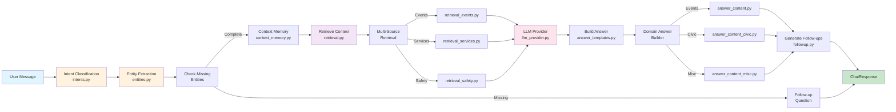

# Civic Chatbot Module

**Overview**: This module implements an intelligent civic assistant for Montgomery, Alabama. It was refactored from a 985-line monolith into 22+ focused modules (2,767 lines total), each with a single responsibility.

The chatbot handles 10+ civic intents (report issues, find services, check events, traffic, safety, etc.), maintains multi-turn conversation context, and routes requests through intent classification, entity extraction, retrieval, and answer generation.

---

## Architecture Overview

### Design Principles
- **Deterministic classification**: Fast, explainable intent and entity detection (no LLM overhead)
- **Lightweight context memory**: Session-based, 30-minute TTL, no database persistence
- **Modular specialization**: Each intent type has dedicated retrieval and answer builders
- **LLM optional**: Template-based answers by default; Gemini API falls back gracefully

---

## Chat Processing Pipeline



**Flow Summary**:
1. **User message arrives** → classify intent (deterministic keyword/pattern matching)
2. **Extract entities** → address, issue type, neighborhood, service category, date/time
3. **Check required entities** → if missing, return follow-up question
4. **Lookup prior context** → detect follow-ups vs. topic switches
5. **Retrieve context** → fetch services, events, news, safety data based on intent
6. **Call LLM** → if Gemini API available; else use templates
7. **Build answer** → dispatch to domain-specific builder (civic, services, misc)
8. **Generate follow-ups** → suggest next steps via chips and actions
9. **Save context** → store in-memory session for multi-turn tracking

---

## Module Dependency Graph

```mermaid
graph TD
    responder["responder.py<br/>Entry Point"]

    responder --> intents["intents.py<br/>Classify Intent"]
    responder --> entities["entities.py<br/>Extract Entities"]
    responder --> context_mem["context_memory.py<br/>Session Tracking"]
    responder --> followup["followup.py<br/>Required Entities"]
    responder --> retrieval["retrieval.py<br/>Dispatcher"]
    responder --> llm["llm_provider.py<br/>Gemini/Mock"]
    responder --> answer_tmpl["answer_templates.py<br/>Router"]
    responder --> followup_h["followup_handlers.py<br/>Multi-turn"]

    retrieval --> retr_events["retrieval_events.py<br/>Events & Traffic"]
    retrieval --> retr_svc["retrieval_services.py<br/>Gov Services"]
    retrieval --> retr_safety["retrieval_safety.py<br/>Safety & Trends"]

    answer_tmpl --> answer_content["answer_content.py<br/>Events & Parks"]
    answer_tmpl --> answer_civic["answer_content_civic.py<br/>Traffic & Jobs"]
    answer_tmpl --> answer_misc["answer_content_misc.py<br/>Reports & Fallback"]

    followup_h --> followup_ans["followup_answer_builders.py<br/>Refine Results"]
    followup_h --> followup_traffic["followup_topic_handlers.py<br/>Traffic & Resident"]
    followup_h --> followup_report["followup_report_handlers.py<br/>Report & Trash"]

    entities --> date_utils["date_utils.py<br/>Temporal Parsing"]

    responder_const["responder_constants.py<br/>Chips & Actions"]
    context_const["context_constants.py<br/>Follow-up Rules"]

    classDef entry fill:#e3f2fd,stroke:#1976d2,stroke-width:2px
    classDef intent fill:#fff3e0,stroke:#f57c00,stroke-width:2px
    classDef retrieval fill:#f3e5f5,stroke:#7b1fa2,stroke-width:2px
    classDef answer fill:#e8f5e9,stroke:#388e3c,stroke-width:2px
    classDef followup fill:#fce4ec,stroke:#c2185b,stroke-width:2px
    classDef util fill:#f5f5f5,stroke:#424242,stroke-width:1px

    class responder entry
    class intents,entities,followup intent
    class retrieval,retr_events,retr_svc,retr_safety retrieval
    class answer_tmpl,answer_content,answer_civic,answer_misc answer
    class followup_h,followup_ans,followup_traffic,followup_report followup
    class date_utils,responder_const,context_const util
```



---

## Intent Classification System

```mermaid
graph TD
    msg["User Message"]

    msg --> report["REPORT_ISSUE<br/>pothole, trash, streetlight"]
    msg --> traffic["TRAFFIC_DISRUPTION<br/>road closed, construction"]
    msg --> events["CITY_EVENTS<br/>festival, concert, activities"]
    msg --> find["FIND_SERVICE<br/>healthcare, childcare, job"]
    msg --> resident["NEW_RESIDENT<br/>just moved, relocate"]
    msg --> job["JOB_LOSS_SUPPORT<br/>lost job, laid off"]
    msg --> trending["TRENDING_ISSUES<br/>biggest issues, trending"]
    msg --> safety["PUBLIC_SAFETY<br/>police, crime, siren"]
    msg --> neighbor["NEIGHBORHOOD_SUMMARY<br/>zip code, area"]
    msg --> suggest["SUGGEST_NEXT_STEP<br/>what should I, recommend"]
    msg --> general["GENERAL<br/>fallback, unclear"]

    report --> report_ret["Retrieve:<br/>311 info, issue types"]
    traffic --> traffic_ret["Retrieve:<br/>News, large events"]
    events --> events_ret["Retrieve:<br/>Mock events, news"]
    find --> find_ret["Retrieve:<br/>Gov services, map points"]
    resident --> resident_ret["Retrieve:<br/>Onboarding services"]
    job --> job_ret["Retrieve:<br/>Multi-category resources"]
    trending --> trending_ret["Retrieve:<br/>Trend detector"]
    safety --> safety_ret["Retrieve:<br/>News, area events"]
    neighbor --> neighbor_ret["Retrieve:<br/>Civic points"]
    suggest --> suggest_ret["Retrieve:<br/>Services"]
    general --> general_ret["Retrieve:<br/>Services (fallback)"]

    report_ret --> report_ans["answer_content_misc<br/>answerReportIssue"]
    traffic_ret --> traffic_ans["answer_content_civic<br/>answerTraffic"]
    events_ret --> events_ans["answer_content<br/>answerEvents"]
    find_ret --> find_ans["answer_content<br/>answerFindService"]
    resident_ret --> resident_ans["answer_content_misc<br/>answerNewResident"]
    job_ret --> job_ans["answer_content_civic<br/>answerJobLoss"]
    trending_ret --> trending_ans["answer_content_misc<br/>answerTrending"]
    safety_ret --> safety_ans["answer_content_civic<br/>answerPublicSafety"]
    neighbor_ret --> neighbor_ans["answer_templates<br/>Neighborhood builder"]
    suggest_ret --> suggest_ans["answer_templates<br/>Next step builder"]
    general_ret --> general_ans["answer_content_misc<br/>answerSmartFallback"]

    style msg fill:#e1f5ff
    style report fill:#fff3e0
    style traffic fill:#fff3e0
    style events fill:#fff3e0
    style find fill:#fff3e0
    style resident fill:#fff3e0
    style job fill:#fff3e0
    style trending fill:#fff3e0
    style safety fill:#fff3e0
    style neighbor fill:#fff3e0
    style suggest fill:#fff3e0
    style general fill:#f5f5f5
```



**Intent Rules**: Each intent defined in `intents.py:INTENT_RULES` with:
- Keywords (low specificity, low weight)
- Regex patterns (higher specificity, higher weight)
- Specificity boost (tiebreaker for ambiguous queries)

Confidence score: 0.0–1.0, capped at 0.95, based on:
```
score = (keyword_hits × 0.15) + (pattern_hits × 0.25) + specificity_boost
```

---

## File-by-File Reference

| **File** | **Lines** | **Purpose** |
|----------|-----------|-----------|
| `responder.py` | 137 | Entry point; orchestrates the full pipeline. |
| `intents.py` | 153 | Deterministic intent classifier using keyword/pattern matching. |
| `entities.py` | 131 | Regex-based entity extractor (address, neighborhood, date, service category). |
| `followup.py` | 64 | Checks for missing required entities and generates follow-up questions. |
| `context_memory.py` | 208 | In-memory session store; tracks conversation state, follows up detection, result refinement. |
| `retrieval.py` | 173 | Intent-aware dispatcher for context retrieval; caches gov services, civic points, news. |
| `retrieval_services.py` | 238 | Service search with multi-category support and synthetic map sources. |
| `retrieval_events.py` | 226 | Event/traffic/new-resident retrieval with date-aware filtering. |
| `retrieval_safety.py` | 152 | Public safety, trending issues, and job loss support context. |
| `llm_provider.py` | 106 | Abstract LLM interface with Gemini and Mock implementations. |
| `answer_templates.py` | 112 | Dispatcher that routes intents to domain-specific answer builders. |
| `answer_content.py` | 161 | Answer builders for events and park/recreation queries. |
| `answer_content_civic.py` | 118 | Answer builders for traffic, job loss, and public safety. |
| `answer_content_misc.py` | 145 | Answer builders for issue reporting, new residents, and smart fallbacks. |
| `followup_handlers.py` | 108 | Orchestrates multi-turn follow-up detection and refinement. |
| `followup_answer_builders.py` | 140 | Builds answer text for traffic, new resident, and refined results. |
| `followup_report_handlers.py` | 88 | Handles report and trash schedule follow-ups. |
| `followup_topic_handlers.py` | 57 | Topic-specific handlers for traffic and new resident conversations. |
| `date_utils.py` | 82 | Temporal intent parsing (today, weekend, next week) into date ranges. |
| `responder_constants.py` | 88 | System prompt, intent chips, and suggested actions. |
| `context_constants.py` | 79 | Follow-up patterns, topic-switch signals, and mapping rules. |
| `__init__.py` | 1 | Module marker. |

**Total: 2,767 lines** (22 files)

---

## Key Design Patterns

### 1. Intent Dispatch Pattern
Every answer builder dispatches based on `CivicIntent` enum:
```python
# answer_templates.py
if intent == CivicIntent.CITY_EVENTS:
    return answer_events(lower, sources)
elif intent == CivicIntent.TRAFFIC_DISRUPTION:
    return answer_traffic(lower, sources)
```

### 2. Multi-Source Retrieval
Retrieval functions return tuples of `(sources, highlights, context_text)`:
```python
sources: list[SourceItem]          # What to show in results
highlights: list[MapHighlight]     # Pins on the map
context_text: str                  # Context for LLM
```

### 3. Session Context Tracking
Lightweight, in-memory per-conversation state:
```python
ConversationContext(
    last_intent, last_question, last_results,
    last_entities, last_topic, turn_count
)
```

### 4. Refinement Pattern
Follow-ups refine prior results using regex filters:
```python
# context_memory.py:REFINEMENT_FILTERS
"free" → filter to free resources
"family-friendly" → filter to family-safe events
"closest to downtown" → filter to downtown locations
```

### 5. Synthetic Fallback Sources
When no real data exists (e.g., parks from frontend map), return synthetic `SourceItem`:
```python
SourceItem(
    title="Parks & Recreation in Montgomery",
    description="...",
    category="parks",  # Indicates frontend map data
)
```

---

## Configuration & Data

### Environment Variables
```bash
GEMINI_API_KEY          # Optional; enables GeminiProvider
GEMINI_MODEL            # Default: gemini-2.0-flash
```

### Data Files (via `backend.config.PUBLIC_DATA`)
- `gov_services.json` — Government service directory
- `civic_services.geojson` — Map points (libraries, parks, fire stations, etc.)
- `news_feed.json` — News articles and safety data
- `mock_data.load_events()` — Mock event dataset

### Session Configuration (`context_constants.py`)
```python
MAX_SESSIONS = 200              # Cap total concurrent sessions
SESSION_TTL = 1800              # 30 minutes before eviction
```

---

## Conversation Flow Examples

### Example 1: Service Request → Follow-up → Refinement
```
User: "I'm looking for childcare"
→ Intent: FIND_SERVICE
→ Entities: service_category=childcare
→ Retrieval: 5 childcare centers
→ Answer: "I found 5 childcare resources..."

Follow-up: "Show me the free ones"
→ Detected as follow-up (refinement)
→ Filter applied: category=free
→ Answer: "From the previous results, here are free options..."
```

### Example 2: Report Issue → Topic-Specific Follow-up
```
User: "Why is traffic so bad?"
→ Intent: TRAFFIC_DISRUPTION
→ Retrieval: traffic news + large events
→ Answer: "Traffic analysis..."

Follow-up: "Is it because of that concert?"
→ Detected as follow-up (topic=traffic)
→ Calls handle_traffic_followup()
→ Answer: "Yes, the concert at [...] could be causing..."
```

### Example 3: Missing Entity Detection
```
User: "I need to report an issue"
→ Intent: REPORT_ISSUE
→ Entities: address=None, issue_type=None
→ Missing: address, issue_type
→ Answer: "I can help. What type of issue? (pothole, streetlight...)"
→ Save context with empty entities
→ Next turn will check for the missing fields
```

---

## Testing Approach

**Core modules to test** (per CLAUDE.md `sub-ares`):
- `intents.classify_intent()` — edge cases: ambiguous queries, empty messages, special chars
- `entities.extract_entities()` — address/neighborhood/date parsing accuracy
- `context_memory.detect_followup()` — follow-up vs. topic-switch detection
- `retrieval.retrieve_context()` — each intent's retrieval logic
- `answer_content*` builders — answer formatting and tone

**Modules to skip**:
- `__init__.py`, constants files
- LLM provider (mock by default; integration tests separate)

**Test structure**:
```
tests/chatbot/
├── test_intents.py          # Positive, negative, edge cases
├── test_entities.py         # Regex pattern coverage
├── test_context_memory.py   # Session lifecycle, follow-up detection
├── test_retrieval.py        # Multi-source retrieval per intent
├── test_answer_builders.py  # Answer formatting consistency
└── test_responder_integration.py  # Full pipeline
```

---

## Common Patterns & Conventions

### 1. Lower-cased Message Processing
Always use `lower()` for keyword matching:
```python
lower = message.lower().strip()
if "free" in lower:
    # apply filter
```

### 2. Entity Dict Unpacking
Extract entities and convert to dict for response:
```python
entity_dict = {k: v for k, v in asdict(entities).items() if v is not None}
```

### 3. Source Item Construction
Always include title, category for routing:
```python
SourceItem(
    title="...",              # Display name
    description="...",        # Optional details
    category="...",           # Events, services, news, etc.
    url="https://..."         # Optional link
)
```

### 4. Follow-up Question Format
Return `None` if no follow-up needed; string if question required:
```python
def check_followup(intent: CivicIntent, entities: ExtractedEntities) -> str | None:
    required = REQUIRED_ENTITIES.get(intent, [])
    for field in required:
        if not getattr(entities, field):
            return FOLLOW_UP_TEMPLATES.get(field)
    return None
```

---

## Extending the Chatbot

### Adding a New Intent

1. **Define intent enum** in `backend.models.CivicIntent`:
   ```python
   class CivicIntent(Enum):
       MY_NEW_INTENT = "my_new_intent"
   ```

2. **Add classification rule** in `intents.py:INTENT_RULES`:
   ```python
   (
       CivicIntent.MY_NEW_INTENT,
       ["keyword1", "keyword2"],
       [r"\bpattern\b", r"\bregex\b"],
   )
   ```

3. **Add entity requirements** in `followup.py:REQUIRED_ENTITIES`:
   ```python
   CivicIntent.MY_NEW_INTENT: ["neighborhood"],  # or []
   ```

4. **Add retrieval logic** in `retrieval.py:retrieve_context()`:
   ```python
   elif intent == CivicIntent.MY_NEW_INTENT:
       s, h, c = _my_retrieval_function(entities, message)
       sources.extend(s); highlights.extend(h); context_parts.append(c)
   ```

5. **Create answer builder** in `answer_content*.py`:
   ```python
   def answer_my_intent(lower: str, sources: list) -> str:
       # ... build answer text ...
   ```

6. **Wire up dispatch** in `answer_templates.py`:
   ```python
   if intent == CivicIntent.MY_NEW_INTENT:
       return answer_my_intent(lower, sources)
   ```

7. **Add UI hints** in `responder_constants.py`:
   ```python
   CivicIntent.MY_NEW_INTENT: ["Suggested chip 1", "Suggested chip 2"],
   ```

---

## Debugging & Observability

### Logging
All modules use `logging.getLogger(__name__)`. Enable debug logs:
```python
import logging
logging.basicConfig(level=logging.DEBUG)
```

Key log points:
- `responder.py` — intent classification and confidence
- `retrieval.py` — data file loading, source count
- `llm_provider.py` — API availability and fallback
- `context_memory.py` — session eviction, follow-up detection

### ChatResponse Debugging
The `ChatResponse` includes introspection fields:
```python
{
    "intent": "...",
    "confidence": 0.75,
    "reasoning_notes": "Intent: FIND_SERVICE | Entities: category=health",
    "answer_summary": "Found 5 health services",
    "source_count": 5,
    "warning": [...]
}
```

### Testing a Single Intent
```python
from backend.chatbot.intents import classify_intent
from backend.chatbot.entities import extract_entities
from backend.chatbot.retrieval import retrieve_context

intent, conf = classify_intent("I need a pothole report")
entities = extract_entities("123 Main Street, downtown")
sources, highlights, context = retrieve_context(intent, entities, message)
```

---

## Performance Notes

- **Intent classification**: O(n) where n = number of keywords + regex patterns (~100 per intent, <1ms)
- **Entity extraction**: O(m) where m = message length; regex-based (~0.1ms)
- **Context memory**: O(1) in-memory dict lookup; LRU eviction at 200 sessions
- **Data caching**: Gov services, civic points, news articles cached on first load
- **LLM fallback**: If Gemini unavailable or fails, immediately uses template-based answer

---

## Future Improvements

1. **Multi-intent detection**: Handle "I want to report a pothole AND find a library" in one turn
2. **Persistent conversation history**: Replace in-memory store with database for longer sessions
3. **User feedback loop**: Log confidence mismatches for intent classifier retraining
4. **Localization**: Templates and entity patterns for other cities/languages
5. **Graph-based reasoning**: Track relationships between entities (e.g., "show parks near the health clinic I found")
6. **RAG system**: Embed citizen-submitted reports and news for semantic similarity matching
7. **Conversation analytics**: Track which intents succeed, which follow-ups are most common

---

## References

- **Entry point**: `responder.py:handle_chat()`
- **Intent definitions**: `intents.py:INTENT_RULES`
- **Entity extraction**: `entities.py:extract_entities()`
- **Multi-turn logic**: `context_memory.py:detect_followup()`
- **Answer dispatch**: `answer_templates.py:build_template_answer()`
- **Configuration**: `responder_constants.py`, `context_constants.py`
