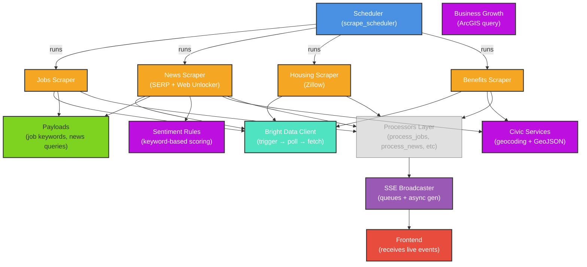

# Core Module

The core module provides the foundational building blocks for Pegasus: API clients for external services, scraping pipeline orchestration, data enrichment rules, and real-time event broadcasting.

## Overview

Four main concerns are handled here:

1. **External APIs** — Bright Data scraper and search clients for jobs, news, housing, and SERP queries
2. **Pipeline Orchestration** — Async scheduler that triggers scrapers on interval and feeds results through processors
3. **Data Transformation** — Payloads, eligibility rules, and sentiment analysis rules for enriching raw data
4. **Real-time Broadcasting** — SSE event queue for pushing live data to connected frontend clients

## Architecture



## Files

| File | Purpose |
|------|---------|
| `bright_data_client.py` | Official Bright Data SDK wrapper — Web Scraper API (trigger/poll), SERP search, and single-page fetcher |
| `scrape_scheduler.py` | Async scheduler that runs jobs, news, housing, and benefits scrapers on interval in thread pool |
| `payloads.py` | Job keywords, news queries, benefit targets, and skill categories that drive scraping |
| `sentiment_rules.py` | Keyword lists and patterns for sentiment scoring and clickbait detection on news articles |
| `build_business_growth.py` | CLI script that queries Montgomery ArcGIS Construction Permits and aggregates into `business_growth.json` |
| `build_civic_services_geojson.py` | CLI script that geocodes civic services (benefits, healthcare, food) and builds searchable GeoJSON |
| `sse_broadcaster.py` | In-memory SSE event queue — clients register, broadcast_event pushes to all queues |
| `__init__.py` | Empty module initialization |

## Key Concepts

### Bright Data Client (`bright_data_client.py`)

Wraps the official `brightdata` SDK with three workflows:

- **Web Scraper API**: `trigger_and_collect()` → trigger a dataset, poll until snapshot ready, download results
- **SERP API**: `serp_search()` and `serp_maps_search()` → Google News and Maps via WebUnlocker
- **Page Fetcher**: `fetch_with_unlocker()` → single URL crawl to markdown/HTML

All functions use `_run_async()` to safely execute async code from sync contexts (thread pool calls).

### Scrape Scheduler (`scrape_scheduler.py`)

Runs on startup and repeats every `SCRAPE_INTERVAL_SECONDS` (default 900s / 15 min):

1. Spawns 4 streams in parallel (jobs, news, housing, benefits)
2. Each runs synchronously in a thread to avoid blocking the event loop
3. Results are processed, saved to disk, and broadcast via SSE to all connected clients

#### Community Sentiment Analysis Flow

After each news scrape, the scheduler chains AI comment analysis to determine how citizens feel about news topics. This produces a **two-layer sentiment model**:

- **Pin color** = article sentiment (rule-based keyword scoring, unchanged)
- **Community badge** = AI-analyzed comment sentiment (only on articles with comments)

```
Citizen posts comment → POST /api/comments → exported_comments.json
                                                ↓
Scrape cycle completes → save_news_articles() → _run_comment_analysis()
                                                ↓
                                run_batch_analysis(articles_with_comments, comments)
                                  (Gemini LLM via LangChain structured output)
                                                ↓
                                merge results → news_feed.json gets community fields:
                                  communitySentiment, communityConfidence,
                                  sentimentBreakdown, communitySummary, urgentConcerns
                                                ↓
                                broadcast SSE "news_sentiment"
                                  → frontend re-fetches news_feed.json
                                  → map re-renders with community badges
```

Key design decisions:

- **localStorage stays the UX source of truth** — the `POST /api/comments` is fire-and-forget so commenting never feels slow
- **Analysis runs after each scrape**, not after each comment — batching is cheaper and avoids hammering the LLM
- **Existing `sentiment` field is untouched** — the new `communitySentiment` fields sit alongside it so nothing breaks
- **`asyncio.run()` is safe** from the ThreadPoolExecutor thread (no running event loop in that context)

### Payloads (`payloads.py`)

Data-heavy constants that feed the scraping pipelines:

- `JOB_SCRAPERS`: 3 job boards × 10–15 keywords each = diverse discovery
- `NEWS_QUERIES`: 22 search queries across 5 categories (general, development, government, events, community)
- `BENEFITS_TARGETS`: URLs for live benefit page scraping
- `SKILL_CATEGORIES`: Job skill taxonomy (education, technical, healthcare, soft skills, etc.)

### Sentiment & Enrichment (`sentiment_rules.py`)

Rule-based scoring on article metadata:

- `score_sentiment()` → counts positive/negative keywords → returns (label, confidence)
- `score_misinfo_risk()` → matches clickbait regex patterns → 0–100 risk score
- `build_summary()` → strips "BREAKING:", "ALERT:", etc. from titles

### GeoJSON Builders

**`build_civic_services_geojson.py`** — Geocodes 30+ services (benefits, healthcare, food, government, housing) using Nominatim with rate limiting, outputs `civic_services.geojson`.

**`build_business_growth.py`** — Queries Montgomery ArcGIS Construction Permits layer, aggregates by month and type, saves `business_growth.json` with 6-month trends and commercial ratio.

### SSE Broadcaster (`sse_broadcaster.py`)

Maintains in-memory registry of connected client queues. `broadcast_event()` is non-blocking:

```python
def broadcast_event(event_type: str, data: list | dict) -> None:
    payload = json.dumps({"type": event_type, "data": data})
    for queue in _client_queues:
        queue.put_nowait(payload)  # drop if queue full
```

Clients consume via `stream_events(queue)` async generator.

## Usage

### Running the Scheduler

```python
from backend.core.scrape_scheduler import start_scheduled_scraping
import asyncio

asyncio.run(start_scheduled_scraping())
```

Typically run as a background task in the FastAPI app.

### Scraping Manually

```python
from backend.core.bright_data_client import trigger_and_collect
from backend.core.payloads import JOB_SCRAPERS

scraper = JOB_SCRAPERS[0]  # Indeed
results = trigger_and_collect(
    dataset_id=scraper["dataset_id"],
    payload=scraper["payload"],
    params=scraper["params"],
)
```

### Building Civic Services GeoJSON

```bash
python backend/core/build_civic_services_geojson.py
```

Output: `scripts/civic_services.geojson`

### Building Business Growth Data

```bash
python backend/core/build_business_growth.py
# or with --dry-run to print JSON instead of writing
python backend/core/build_business_growth.py --dry-run
```

Output: `frontend/public/data/business_growth.json`

### Broadcasting Events

```python
from backend.core.sse_broadcaster import broadcast_event, create_client_queue

# Client connects
queue = create_client_queue()

# Data arrives
broadcast_event("jobs", feature_list)

# Frontend receives via SSE stream
async for event in stream_events(queue):
    yield event
```

## Error Handling

- **Bright Data client** — returns `None` or `[]` on failure; logs errors
- **Scheduler** — logs failures per stream, continues on next interval
- **GeoJSON builders** — logs missing coordinates; skips ungeocodable services
- **SSE broadcaster** — drops events for slow clients (queue full)

## Configuration

Environment variables:

- `SCRAPE_INTERVAL` — Seconds between scrape runs (default: 900)
- `BRIGHTDATA_API_KEY` — Retrieved from `backend.config.get_api_key()`
- `SERP_ZONE` — Bright Data SERP zone ID
- `DATASETS` — Dict of dataset IDs (from `backend.config.DATASETS`)

## Dependencies

- `brightdata>=0.4` — Official Bright Data SDK
- `requests` — HTTP client for fallback SERP queries
- `asyncio` — Async concurrency
- Standard library: `json`, `re`, `urllib`, `logging`

---

See `backend/processors/` and `backend/triggers/` for downstream processing pipelines.
