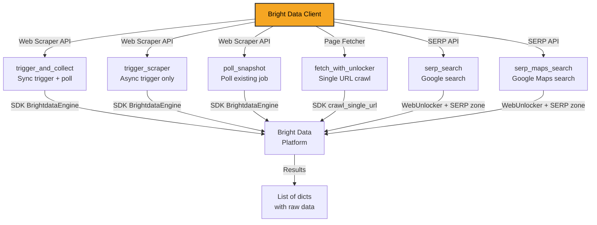
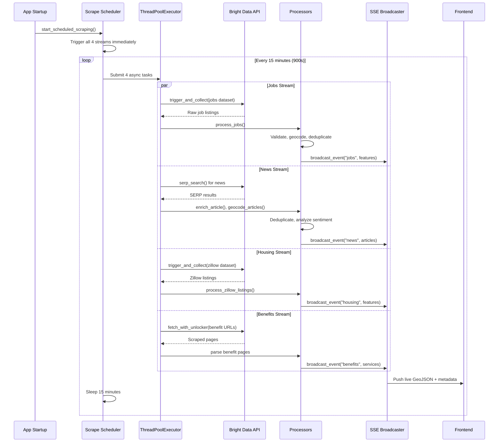
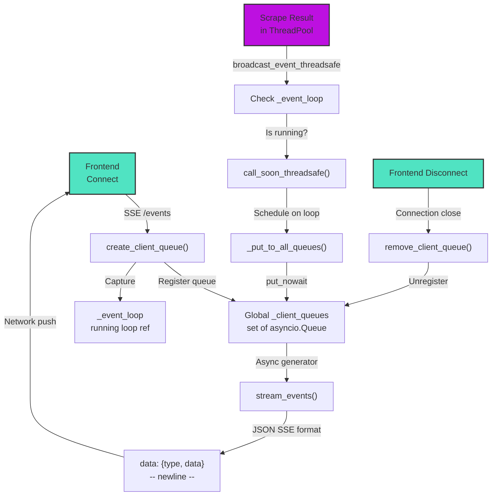

# Core Infrastructure Layer

Core modules that power data collection, processing, and real-time delivery in Pegasus. This layer orchestrates scraping, sentiment analysis, and live event broadcasting to the frontend.

## Overview

The core layer manages four critical functions:

1. **Data Collection** — Bright Data API integration for web scraping, SERP searches, and page fetching
2. **Scheduling** — Background task runner that triggers scrapes every 15 minutes for jobs, news, housing, and benefits
3. **Real-Time Delivery** — Server-Sent Events (SSE) broadcaster that pushes live data updates to connected frontend clients
4. **Sentiment Analysis** — Rule-based keyword matching for news article sentiment and misinformation risk scoring

## Module Reference

| Module | Purpose | Key Functions |
|--------|---------|---|
| `bright_data_client.py` | Bright Data SDK wrapper for web scraping & SERP searches | `trigger_and_collect()`, `trigger_scraper()`, `poll_snapshot()`, `fetch_with_unlocker()`, `serp_search()`, `serp_maps_search()` |
| `scrape_scheduler.py` | Background scheduler — runs all scrape streams on startup & every 15 min | `start_scheduled_scraping()`, `run_all_streams()`, `_run_jobs_scrape()`, `_run_news_scrape()`, `_run_housing_scrape()`, `_run_benefits_scrape()` |
| `sse_broadcaster.py` | In-memory SSE queue manager for pushing real-time events to frontend | `create_client_queue()`, `broadcast_event()`, `broadcast_event_threadsafe()`, `stream_events()` |
| `sentiment_rules.py` | Rule-based sentiment & misinformation scoring for news articles | `score_sentiment()`, `score_misinfo_risk()`, `build_summary()` |
| `redis_client.py` | Optional Redis caching for roadmap generation (fails open) | `RedisCache` singleton with `fetch()`, `store()`, `delete()` methods |
| `exceptions.py` | Application error hierarchy — base exception + domain-specific types | `AppException`, `ValidationError`, `NotFoundError`, `ConflictError`, `AuthError`, `ExternalServiceError` |

---

## Architecture

### Bright Data Client

Thin wrapper around the Bright Data SDK for three scraping modes:



**Key Design:**

- Uses SDK `BrightdataEngine.trigger()` for Web Scraper API (dataset-based scraping)
- Falls back to `WebUnlocker` for SERP queries with configurable zones
- Synchronous `_run_async()` wrapper converts async SDK calls to sync (needed for ThreadPoolExecutor context)
- Thread-safe and handles both JSON and HTML SERP responses

**Configuration** (from `config.py:39-46`):

```python
DATASETS = {
    "indeed": "gd_l4dx9j9sscpvs7no2",
    "linkedin": "gd_lpfll7v5hcqtkxl6l",
    "glassdoor_jobs": "gd_lpfbbndm1xnopbrcr0",
    "glassdoor_reviews": "gd_l7j1po0921hbu0ri1z",
    "zillow": "gd_lfqkr8wm13ixtbd8f5",
    "crawl": "gd_m6gjtfmeh43we6cqc",
}
```

### Scrape Scheduler

Background task runner that orchestrates all data collection streams. Runs inside the webhook FastAPI server as an async task.



**Key Characteristics:**

- Runs on startup and repeats every 900 seconds (configurable via `SCRAPE_INTERVAL`)
- Uses `ThreadPoolExecutor` with 2 workers to avoid blocking the async event loop
- Each stream (jobs, news, housing, benefits) runs in parallel
- Results flow through a standard pipeline: raw data → validation → geocoding → deduplication → database save → SSE broadcast
- Handles comment analysis as a chained task after news is processed
- Logs structured timestamps and item counts for observability

**Configuration** (from `scrape_scheduler.py:24`):

```python
SCRAPE_INTERVAL_SECONDS = int(os.environ.get("SCRAPE_INTERVAL", "900"))
```

---

### SSE Broadcaster

In-memory queue-based system for pushing real-time updates to connected frontend clients.



**Key Characteristics:**

- **Thread-safe broadcasts** — `broadcast_event_threadsafe()` uses `call_soon_threadsafe()` to schedule queue writes on the event loop
- **Async context** — All queues live in one set; new clients register when they connect
- **Fire-and-forget** — If a client's queue is full, events are dropped (slow clients don't block fast ones)
- **SSE format** — Payload is JSON: `{"type": "jobs", "data": [...]}`
- **No persistence** — Clients must be connected at broadcast time to receive events

**Data Flow:**

1. Frontend opens EventSource connection → `/api/stream`
2. `create_client_queue()` registers new queue
3. Scrape scheduler runs in ThreadPool
4. Results call `broadcast_event_threadsafe("jobs", [...])`
5. Callback queues event on the async event loop
6. `stream_events()` generator yields SSE-formatted data
7. Frontend receives `"data: {...}\n\n"` and parses JSON

---

### Sentiment Rules

Rule-based keyword and pattern matching for news article classification.

**Sentiment Scoring** (`score_sentiment()`):

```
Input: title, excerpt
  ↓
Count positive keywords: growth, improve, invest, new, grant, award, ...
Count negative keywords: shooting, murder, crime, arrest, fire, fraud, ...
  ↓
If positive > negative:
  confidence = 50 + (positive - negative) * 10
  label = "positive"
Elif negative > positive:
  confidence = 50 + (negative - positive) * 10
  label = "negative"
Else:
  label = "neutral", confidence = 30
  ↓
Output: (label, confidence_0_to_100)
```

**Misinformation Risk** (`score_misinfo_risk()`):

Pattern matches on title:

- `(?i)\b(shocking|unbelievable|you won't believe|exposed|breaking)\b` → +25
- `(?i)^LIVE:` → +25
- `(?i)\b(ALERT|URGENT|JUST IN)\b` → +25
- `(?i)\b(secret|conspiracy|coverup|cover-up)\b` → +25
- `(?i)!\s*!+` → +25
- `(?i)\b(they don't want you to know)\b` → +25

Sum = 0–150, clamped to 0–100

**Summary Building** (`build_summary()`):

Strips known prefixes (LIVE:, BREAKING:, ALERT:, etc.) for cleaner display.

---

## Configuration

Central config file: `backend/config.py`

### Credentials (Environment Variables)

```python
BRIGHTDATA_API_KEY          # Required — Bright Data API key
BRIGHTDATA_SERP_ZONE        # Optional — SERP zone (default: "serp_api1")
BRIGHTDATA_UNLOCKER_ZONE    # Optional — Web Unlocker zone (default: "web_unlocker1")
WEBHOOK_SECRET              # Optional — Webhook signature validation
REDIS_URL                   # Optional — Redis connection for caching
```

### Paths

```python
REPO_ROOT                   # Project root directory
PUBLIC_DATA                 # frontend/public/data (frontend-visible GeoJSON)
SCRIPTS_DATA                # backend/data (intermediate & historical data)
RAW_DIR                     # backend/data/raw (raw scraper output)

OUTPUT_FILES = {
    "jobs": "frontend/public/data/jobs.geojson",
    "jobs_history": "backend/data/jobs_history.jsonl",
    "news": "frontend/public/data/news_feed.json",
    "benefits": "frontend/public/data/gov_services.json",
    "housing": "frontend/public/data/housing.geojson",
}
```

---

## Error Handling

Exceptions are defined in `backend/core/exceptions.py`:

```python
AppException(code, message, details, status_code)
├── ValidationError(message, details) → 422
├── NotFoundError(message, details) → 404
├── ConflictError(message, details) → 409
├── AuthError(message, details) → 401
└── ExternalServiceError(message, details) → 502
```

**Usage Pattern:**

```python
try:
    result = trigger_scraper(dataset_id, payload)
except ExternalServiceError as e:
    logger.error("Scrape failed: %s", e.message)
    # Fallback or retry logic
```

---

## Redis Caching

Optional, fail-safe caching for roadmap generation.

**Behavior:**

- If `REDIS_URL` unset → caching disabled
- If connection fails → logs warning, continues without cache
- Singleton pattern — one client instance per process

**Methods:**

```python
from backend.core.redis_client import cache

# Fetch
data = cache.fetch("roadmap:2026-03")  # dict or None

# Store (with 24h TTL by default)
cache.store("roadmap:2026-03", {"features": [...]}, ttl=86400)

# Delete
cache.delete("roadmap:2026-03")

# Check availability
if cache.is_available():
    print("Redis is connected")
```

---

## Integration Points

### With Processors

Each scrape stream calls processor modules to validate, enrich, and save data:

- **Jobs**: `backend.processors.process_jobs` → geocode → save to jobs.geojson
- **News**: `backend.processors.process_news` → enrich + geocode → deduplicate → save + sentiment analysis
- **Housing**: `backend.processors.process_housing` → validate Zillow listings → save to housing.geojson
- **Benefits**: `backend.processors.process_benefits` → merge with fallback services → save to gov_services.json

### With API

The FastAPI app (`backend/api/main.py`) starts the scheduler on startup:

```python
async def lifespan(app):
    # Startup
    asyncio.create_task(start_scheduled_scraping())
    yield
    # Shutdown
```

And exposes the SSE endpoint:

```python
@router.get("/stream")
async def stream_events(queue: asyncio.Queue = Depends(get_sse_queue)):
    return StreamingResponse(stream_events(queue), media_type="text/event-stream")
```

---

## Workflow Example: News Scrape

1. **Trigger** — `_run_news_scrape()` called by scheduler
2. **Discover** — `discover_articles()` uses `serp_search("Montgomery Alabama news")` to find articles
3. **Fetch Full Text** — Top 10 articles downloaded via `fetch_with_unlocker(article_url)`
4. **Enrich** — `enrich_article()` applies sentiment rules, checks metadata
5. **Geocode** — `geocode_articles()` extracts location entities
6. **Deduplicate** — Merge with existing articles, remove duplicates by title/URL
7. **Save** — Articles written to `frontend/public/data/news_feed.json`
8. **Broadcast** — `broadcast_event_threadsafe("news", articles)` → frontend receives via SSE
9. **Analyze Comments** — If comments exist, trigger AI sentiment analysis on articles with community feedback

---

## Testing

Tests for core modules located in `backend/tests/`:

- `test_bright_data_client.py` — Mock SDK calls, validate trigger/poll/fetch
- `test_sse_broadcaster.py` — Queue registration, broadcast ordering, thread-safety
- `test_sentiment_rules.py` — Keyword matching, score normalization
- `test_scrape_scheduler.py` — Stream execution, error handling, item counts

Run tests:

```bash
pytest backend/tests/test_*.py -v
```

---

## References

- [Bright Data SDK Docs](https://github.com/bright-data/sdk)
- [FastAPI Streaming Responses](https://fastapi.tiangolo.com/advanced/custom-response/#streaming-responses)
- [SSE Format (MDN)](https://developer.mozilla.org/en-US/docs/Web/API/Server-sent_events)
- `backend/payloads.py` — Scraper payload definitions and job categories
