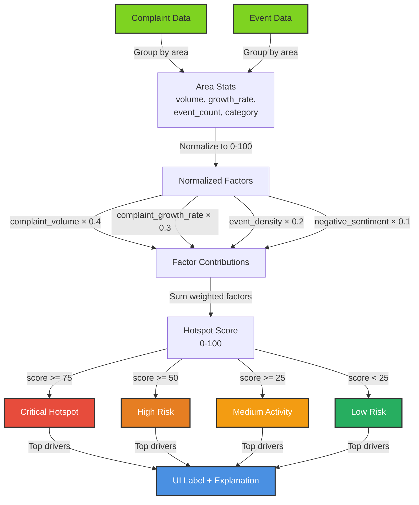
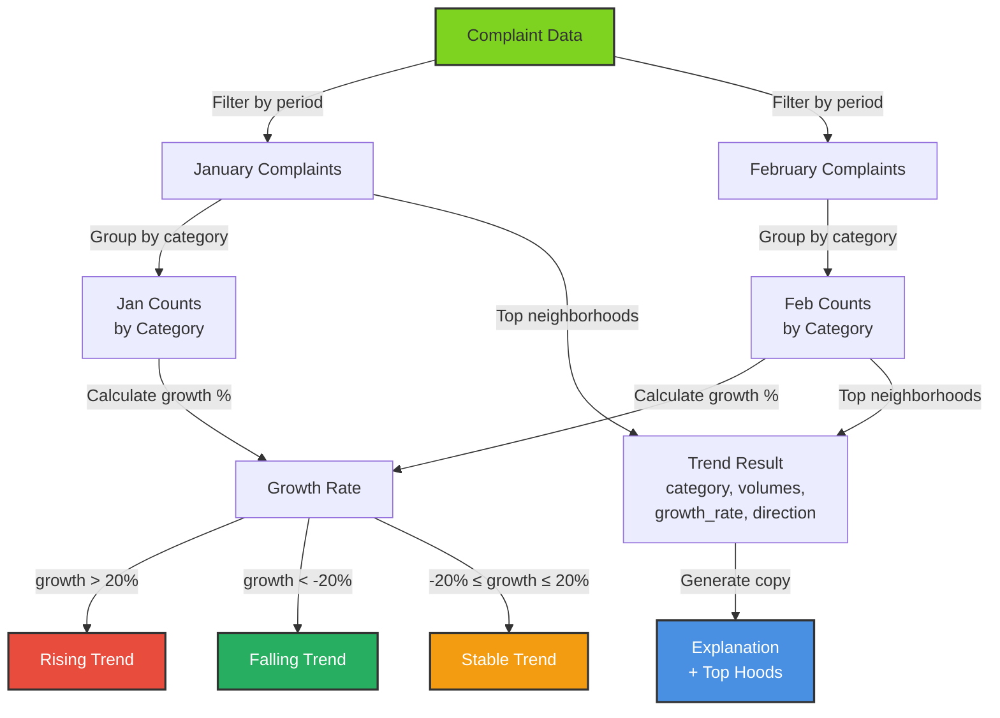

# Predictive Analytics Module

Weighted hotspot scoring and trend detection engine for civic complaint data. Identifies neighborhoods at risk for service failures and tracks complaint category trends over time.

## Overview

The predictive module delivers two core analytics products:

1. **Hotspot Scoring** — Computes a weighted risk score for each neighborhood based on complaint volume, growth rate, event density, and sentiment
2. **Trend Detection** — Analyzes complaint volumes across time periods to detect rising, stable, or falling trends by category

These analytics feed the frontend dashboard to help residents and city planners identify problem areas and plan interventions.

## Module Reference

| Module | Purpose | Key Functions |
|--------|---------|---|
| `hotspot_scorer.py` | Weighted hotspot risk calculation with normalized factors | `compute_hotspots()`, `_score_area()`, `_normalize()`, `_risk_level()`, `_build_explanation()` |
| `trend_detector.py` | Category-level trend analysis across time periods | `detect_trends()`, `_build_trend_explanation()` |
| `hotspot_config.py` | Configuration constants for weights, thresholds, and factor labels | `WEIGHTS`, `RISK_THRESHOLDS`, `FACTOR_LABELS` |
| `mock_data.py` | Data loaders for mock complaints and events | `load_complaints()`, `load_events()` |

---

## Architecture

### Hotspot Scoring

Computes a composite risk score for each neighborhood using a weighted formula combining four factors.



**Weighting Formula** (from `hotspot_config.py:4-9`):

```python
hotspot_score = (
    0.4 * normalized_complaint_volume +
    0.3 * normalized_complaint_growth_rate +
    0.2 * normalized_event_density +
    0.1 * normalized_negative_sentiment
)
```

**Risk Level Classification** (from `hotspot_config.py:12-17`):

```python
RISK_THRESHOLDS = {
    "critical": 75,  # score >= 75
    "high": 50,      # score >= 50
    "medium": 25,    # score >= 25
    "low": 0,        # score >= 0
}
```

**Normalization Process** (`_normalize()` function):

```
Input: value, max_value
  ↓
If max_value <= 0:
  normalized = 0
Else:
  normalized = min(100, (value / max_value) * 100)
  ↓
Output: 0-100 scale
```

**Key Characteristics:**

- **Relative scoring** — Each factor is normalized to 0–100 by dividing by the neighborhood max
- **Multi-period analysis** — Compares January vs. February complaint volumes to detect trends
- **Driver attribution** — For each neighborhood, tracks which factors contribute most to the score
- **Explainable output** — Generates human-readable explanations and UI labels for each hotspot

**Output Structure** (PredictionResult):

```python
{
    "area_id": "downtown",
    "neighborhood": "Downtown Montgomery",
    "category": "infrastructure",
    "hotspot_score": 72.5,
    "risk_level": "high",
    "trend_direction": "rising",
    "drivers": [
        {
            "factor": "complaint_volume",
            "value": 85.0,
            "weight": 0.4,
            "contribution": 34.0
        },
        # ... other drivers
    ],
    "recommended_label_for_ui": "🟠 Downtown Montgomery: High infrastructure risk",
    "explanation": "Downtown Montgomery shows elevated infrastructure activity. Main driver: complaint volume."
}
```

---

### Trend Detection

Analyzes complaint categories across periods to identify rising, stable, or declining trends.



**Trend Direction Logic** (from `trend_detector.py:39-44`):

```python
if growth > 20:
    direction = "rising"
elif growth < -20:
    direction = "falling"
else:
    direction = "stable"
```

**Output Structure** (TrendResult):

```python
{
    "category": "infrastructure",
    "current_volume": 45,
    "previous_volume": 30,
    "growth_rate": 50.0,  # percent
    "trend_direction": "rising",
    "top_neighborhoods": ["Downtown Montgomery", "East Montgomery"],
    "explanation": "Infrastructure complaints rose from 30 to 45 (+15). Most concentrated in Downtown Montgomery, East Montgomery."
}
```

**Key Characteristics:**

- **Bi-period comparison** — Compares fixed Jan vs. Feb (not rolling window)
- **Category-level trends** — Aggregates across all neighborhoods per category
- **Top neighborhoods** — Identifies the 3 neighborhoods with highest Feb volume per category
- **Growth rate calculation** — `(Feb - Jan) / Jan * 100`
- **Sorted output** — Results ordered by absolute growth rate (largest changes first)

---

## Configuration

Central configuration file: `backend/predictive/hotspot_config.py`

### Scoring Weights

All weights must sum to 1.0 (currently: 0.4 + 0.3 + 0.2 + 0.1 = 1.0):

```python
WEIGHTS = {
    "complaint_volume": 0.4,          # 40% — Raw complaint count
    "complaint_growth_rate": 0.3,     # 30% — Month-over-month growth
    "event_density": 0.2,             # 20% — Concurrent event activity
    "negative_sentiment": 0.1,        # 10% — Community sentiment (optional)
}
```

**Rationale:**

- **Volume (40%)** — More complaints = higher risk (dominant signal)
- **Growth (30%)** — Rising trends need attention even if current volume is moderate
- **Events (20%)** — Upcoming events can trigger increased demand/issues
- **Sentiment (10%)** — Community mood is a soft signal; optional if unavailable

### Risk Thresholds

Boundaries for classifying neighborhoods into risk categories:

```python
RISK_THRESHOLDS = {
    "critical": 75,   # Immediate intervention needed
    "high": 50,       # Close monitoring recommended
    "medium": 25,     # Watch for escalation
    "low": 0,         # Baseline/normal
}
```

### Factor Labels

Human-readable names for use in explanations and UI:

```python
FACTOR_LABELS = {
    "complaint_volume": "complaint volume",
    "complaint_growth_rate": "rising complaint trend",
    "event_density": "upcoming event activity",
    "negative_sentiment": "negative community sentiment",
}
```

---

## Data Sources

### Mock Data

Loaded from JSON files in `backend/data/`:

**`mock_complaints.json`** structure:

```json
{
    "complaints": [
        {
            "area_id": "downtown",
            "neighborhood": "Downtown Montgomery",
            "category": "infrastructure",
            "date": "2026-02-15",
            "description": "Pothole on Main St"
        },
        ...
    ]
}
```

**`mock_events.json`** structure:

```json
{
    "events": [
        {
            "area_id": "downtown",
            "name": "Winter Festival 2026",
            "date": "2026-02-20",
            "expected_attendance": 5000
        },
        ...
    ]
}
```

**Data Loaders** (`mock_data.py`):

- `load_complaints()` — Returns list of complaint dicts; empty list if file missing
- `load_events()` — Returns list of event dicts; empty list if file missing

---

## API Integration

### Hotspot Endpoint

```python
GET /api/hotspots

Response: {
    "hotspots": [
        {
            "area_id": "downtown",
            "neighborhood": "Downtown Montgomery",
            "category": "infrastructure",
            "hotspot_score": 72.5,
            "risk_level": "high",
            "trend_direction": "rising",
            "drivers": [
                {
                    "factor": "complaint_volume",
                    "value": 85.0,
                    "weight": 0.4,
                    "contribution": 34.0
                },
                ...
            ],
            "recommended_label_for_ui": "🟠 Downtown Montgomery: High infrastructure risk",
            "explanation": "..."
        },
        ...
    ]
}
```

### Trend Endpoint

```python
GET /api/trends

Response: {
    "trends": [
        {
            "category": "infrastructure",
            "current_volume": 45,
            "previous_volume": 30,
            "growth_rate": 50.0,
            "trend_direction": "rising",
            "top_neighborhoods": ["Downtown Montgomery", "East Montgomery"],
            "explanation": "..."
        },
        ...
    ]
}
```

---

## Usage

### Computing Hotspots

```python
from backend.predictive.hotspot_scorer import compute_hotspots

# Without sentiment scores
hotspots = compute_hotspots()

# With sentiment scores (optional)
sentiment_scores = {
    "downtown": 45.0,      # 0-100 negative sentiment score
    "east_montgomery": 30.0,
}
hotspots = compute_hotspots(sentiment_scores=sentiment_scores)

# Iterate and use
for hotspot in hotspots:
    print(f"{hotspot.neighborhood}: {hotspot.risk_level}")
    print(f"Score: {hotspot.hotspot_score}")
    print(f"Explanation: {hotspot.explanation}")
```

### Detecting Trends

```python
from backend.predictive.trend_detector import detect_trends

trends = detect_trends()

for trend in trends:
    print(f"{trend.category}: {trend.trend_direction}")
    print(f"Growth: {trend.growth_rate}%")
    print(f"Top areas: {', '.join(trend.top_neighborhoods)}")
```

---

## Workflow Example

**Scenario:** User opens dashboard at 2026-03-08

1. **Load Data** — `load_complaints()` and `load_events()` from mock JSON
2. **Compute Hotspots** — Call `compute_hotspots()`
   - Group by area_id
   - Count Jan/Feb volumes, calculate growth
   - Normalize factors (volume, growth, events, sentiment)
   - Apply weights, sum to get hotspot_score
   - Classify into risk level
3. **Detect Trends** — Call `detect_trends()`
   - Group complaints by category and period
   - Calculate growth rate
   - Determine direction (rising/stable/falling)
   - Find top neighborhoods per category
4. **API Returns** — Both hotspots and trends as JSON
5. **Frontend Renders** — Map shows colored pins + sidebar cards with explanations

---

## Normalization Details

### Why Normalize?

Different factors have different scales:

- **Volume**: 0–100+ complaints
- **Growth**: −100% to +500%
- **Events**: 0–20 events
- **Sentiment**: 0–100 (already normalized)

Normalizing ensures each factor contributes proportionally despite different scales.

### Normalization Algorithm

```python
def _normalize(value: float, max_value: float) -> float:
    if max_value <= 0:
        return 0.0
    return min(100.0, (value / max_value) * 100.0)
```

**Examples:**

- `_normalize(50, 100)` → 50.0 (50% of max)
- `_normalize(150, 100)` → 100.0 (capped at 100)
- `_normalize(0, 100)` → 0.0 (no signal)
- `_normalize(10, 0)` → 0.0 (no max; no comparison)

---

## Error Handling

### Missing Data

- **No complaints** → Returns empty hotspots list
- **No events** → Scores with event_density = 0 (no penalty)
- **No sentiment scores** → Uses sentiment_scores.get(area_id, 0.0) (defaults to 0)
- **File missing** → `load_complaints()` / `load_events()` return empty list

### Invalid Inputs

- **Division by zero** — Protected by `max(..., 1)` in growth calculation
- **Negative growth** — `max(stats["growth"], 0)` ensures non-negative before normalization
- **Empty driver list** — Explanations check `if drivers` before accessing

---

## Testing

Tests for predictive modules located in `backend/tests/`:

- `test_hotspot_scorer.py` — Normalization, weighting, risk classification, driver ranking
- `test_trend_detector.py` — Period grouping, growth calculation, trend direction, explanations
- `test_hotspot_config.py` — Weight sums to 1.0, thresholds are ordered

Run tests:

```bash
pytest backend/tests/test_predictive_*.py -v
pytest backend/tests/test_hotspot_*.py -v
pytest backend/tests/test_trend_*.py -v
```

---

## References

- `backend/models.py` — `PredictionResult` and `TrendResult` Pydantic models
- `backend/api/routers/hotspots.py` — API endpoints for hotspots and trends
- `backend/data/mock_*.json` — Mock data sources
