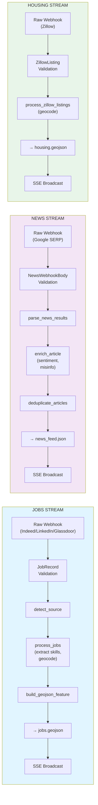
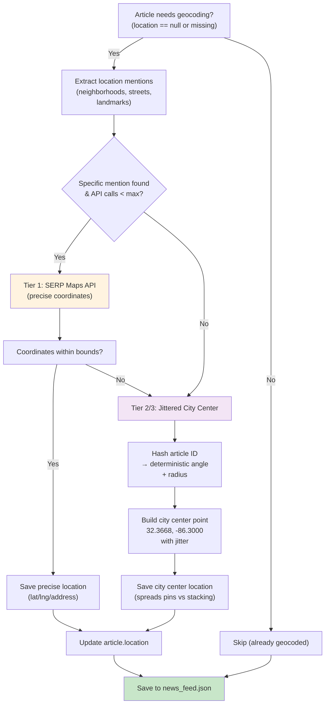

# Data Processors Module

The processors module ingests raw webhook data from three external sources (jobs, news, housing) and transforms them into standardized GeoJSON and JSON formats for the frontend map and dashboards.

## Overview

Three parallel data streams feed the system:

- **Jobs**: Indeed, LinkedIn, Glassdoor job postings → skill extraction + geocoding → `jobs.geojson`
- **News**: Google News SERP results → sentiment enrichment + community analysis → `news_feed.json`
- **Housing**: Zillow listings → property standardization → `housing.geojson`

All processors validate inputs, handle errors gracefully, and broadcast updates via Server-Sent Events (SSE) to connected clients.

---

## Processing Pipeline



---

## News Enrichment Detail

News articles are enriched with two types of sentiment:

1. **Rule-based sentiment** (immediate, deterministic): Scoring title and excerpt for tone.
2. **Community sentiment** (asynchronous, AI-driven): Analyzed by LLM after comments are collected.

```mermaid
sequenceDiagram
    participant Raw as Raw Article<br/>(from SERP)
    participant SS as score_sentiment
    participant SM as score_misinfo_risk
    participant BS as build_summary
    participant GC as geocode_articles
    participant LLM as LLM Analysis<br/>(analyze_comments)
    participant Feed as news_feed.json

    Raw->>SS: title + excerpt
    SS->>SS: rule-based tone<br/>detection
    SS->>SM: sentiment assigned
    SM->>SM: keyword patterns for<br/>misinformation risk
    SM->>BS: misinfo risk assigned
    BS->>BS: extract key phrase<br/>from title
    BS->>GC: summary built
    GC->>GC: extract location mentions<br/>+ geocode
    GC->>Feed: save article<br/>(base enrichment)

    Note over LLM: Later: async batch analysis
    Feed->>LLM: articles + comments
    LLM->>LLM: parallel analysis<br/>(gemini-3.1-flash-lite)
    LLM->>Feed: inject communitySentiment<br/>+ communityConfidence<br/>+ sentimentBreakdown<br/>+ communitySummary

    style SS fill:#fff3e0
    style SM fill:#fff3e0
    style BS fill:#fff3e0
    style LLM fill:#f3e5f5
    style Feed fill:#c8e6c9
```

---

## Geocoding Pipeline

News articles require precise location tagging to place pins on the map. A three-tier strategy handles different levels of location specificity.



**Three Tiers Explained:**

1. **Tier 1 — Specific Mention** (most precise): Article mentions a neighborhood, street, or landmark → call Bright Data Google Maps SERP → use exact coordinates.
2. **Tier 2/3 — City Level** (fallback): Article mentions Montgomery or state-level entities → use jittered city center (32.3668, -86.3000) with deterministic spread to avoid pin stacking.

---

## Processor Files Reference

| File | Input Format | Processing | Output Format | Output Path |
|------|--------------|-----------|---------------|-------------|
| `process_jobs.py` | `list[dict]` from Indeed/LinkedIn/Glassdoor webhooks | Source detection, skill extraction (keyword match), ArcGIS + Nominatim geocoding, ID generation | `list[dict]` with enriched job records | Piped to `scrape_orchestrators.build_geojson_feature` |
| `scrape_orchestrators.py` | Processed job dicts | GeoJSON Feature construction, deduplication by ID, merge with existing | GeoJSON FeatureCollection | `public/data/jobs.geojson` + `public/data/jobs.history` |
| `process_news.py` | SERP response body (dict) | Parse results, extract title/URL/snippet, generate article ID, enrich with rule-based sentiment/misinfo, deduplicate | `list[dict]` articles with sentiment fields | `public/data/news_feed.json` |
| `geocode_news.py` | `list[dict]` articles with missing location | Extract location mentions, tier 1 (SERP Maps) or tier 2 (jittered city center), bounds check | `list[dict]` articles with location dict | Back-written to `news_feed.json` |
| `analyze_comments.py` | `news_feed.json` + comment records | Load articles, batch async analysis via Gemini with prompt, store per-article scores + recommendations | `AnalysisResults` schema (Pydantic) | `backend/data/analysis_results.json` + metrics JSONL |
| `process_housing.py` | Zillow listing dicts | Property field normalization, address assembly, Nominatim geocoding fallback, price formatting, ID generation | GeoJSON FeatureCollection | `public/data/housing.geojson` |
| `process_benefits.py` | Government website markdown | Parse income tables, eligibility/requirement lists, extract phone/provider, merge with fallback JSON | `list[dict]` benefit services | `public/data/gov_services.json` |
| `geocoding_utils.py` | Address string | Nominatim API call with user-agent, return (lat, lng) or None | `tuple[float, float] \| None` | Used by all processors |
| `geocoding_constants.py` | (config) | Define Montgomery bounds, neighborhoods, landmarks, location patterns, city-level keywords | Constants for lookup/matching | Imported by `geocode_news.py` |
| `redact_pii.py` | String (comment text) | Regex patterns: phone (###-###-####), email (name@domain), address (## Street Ave) | Redacted string | Used by `analyze_comments.py` before LLM |
| `schemas.py` | (shared) | Pydantic models for structured LLM output: `CommentAnalysis`, `ArticleAnalysis`, `AnalysisResults`, `Recommendation` | Schema definitions | Imported by `analyze_comments.py` |

---

## Key Functions

### Job Processing

**`process_jobs(raw_jobs: list[dict], source: str) -> list[dict]`**
Full pipeline: detect source, extract skills using keyword matching, geocode via ArcGIS Business Licenses (faster) or Nominatim (fallback), tag with `_id`, `_source`, `_scraped_at`.

**`detect_source(raw_jobs: list[dict]) -> str`**
Inspect first job record for job board signatures: `job_seniority_level` → LinkedIn, `company_url_overview` → Glassdoor, else Indeed.

**`extract_skills(description: str) -> dict[str, list[str]]`**
Keyword matching against `SKILL_CATEGORIES` from config. Returns `{category: [matched_skills]}`.

**`search_arcgis_business(company_name: str) -> tuple | None`**
Query ArcGIS Feature Server for business license records. Returns (lat, lng, name, address) or None.

### News Processing

**`parse_news_results(body: dict, category: str) -> list[dict]`**
Extract news items from SERP response (handles multiple field names: `news`, `organic`, `results`). Build article dicts with title, URL, snippet, source, published date, thumbnail.

**`enrich_article(article: dict) -> dict`**
Score sentiment (rule-based), misinfo risk (pattern-based), and summary (extract key phrase).

**`deduplicate_articles(articles: list[dict]) -> list[dict]`**
Remove duplicates by article ID. Stable hashing: `md5(title + url)[:12]`.

**`merge_community_sentiment_into_news_feed(results: AnalysisResults) -> None`**
After LLM analysis, inject community-driven fields into articles: `communitySentiment`, `communityConfidence`, `sentimentBreakdown`, `communitySummary`, `urgentConcerns`.

### Geocoding

**`geocode_articles(articles: list[dict], max_geocode: int = 500) -> list[dict]`**
Three-tier geocoding for news articles. Tier 1 (specific location) uses Bright Data SERP Maps. Tier 2/3 (city level or none) uses jittered city center.

**`extract_location_mentions(title: str, excerpt: str) -> list[str]`**
Regex + keyword matching to find neighborhoods, landmarks, and street patterns.

**`build_jittered_city_center(article_id: str) -> dict`**
Deterministic jitter using article ID hash. Spreads pins across downtown instead of stacking at city center (32.3668, -86.3000).

### Housing Processing

**`process_zillow_listings(raw_listings: list[dict]) -> list[dict]`**
Normalize Zillow fields, assemble full address, geocode if missing coordinates, format price, build GeoJSON features.

### Benefits Processing

**`parse_benefit_markdown(markdown: str, target: dict) -> dict`**
Extract structured eligibility rules, income limits (tables), requirements (bullet lists), phone, provider name.

### Comment Analysis

**`run_batch_analysis(articles: list[dict], comments: list[dict]) -> AnalysisResults`**
Async batch analysis using Gemini 3.1 Flash Lite. Runs up to 10 concurrent LLM calls per article. Returns structured `AnalysisResults` with sentiment, topics, recommendations.

---

## SSE Broadcasting

Each processor publishes updates via Server-Sent Events after saving data:

```python
# Example from API layer (not in processors, but consumes processor output)
broadcast({
    "type": "jobs_updated",
    "count": 42,
    "timestamp": "2026-03-08T12:34:56Z"
})
```

Clients subscribe to a single SSE endpoint:
- `/api/stream` — Multiplexed stream for all data types (jobs, news, housing, analysis)

---

## Data Validation

All processors expect validated Pydantic schemas:

- **Jobs**: `JobRecord` (validates job_title, company_name, url, location)
- **News**: `NewsWebhookBody` (validates news items, category)
- **Housing**: `ZillowListing` (validates address, price, coordinates)

Validation errors are logged and the record is skipped (resilience over completeness).

---

## Performance Tuning

### Caching

Processors use in-memory caches to avoid redundant API calls:

- **ArcGIS Business License** cache (per company name)
- **Nominatim** address cache (per full address)
- **Analysis** results memory (dedup seen article IDs)

### Rate Limiting

- ArcGIS calls: 0.3s sleep between lookups
- Nominatim calls: 1.0s sleep between lookups
- Bright Data SERP Maps: ~1.0s per call (API provider limit)
- LLM batch analysis: 10 concurrent requests (semaphore)

### Deduplication

All processors include stable ID generation to prevent duplicates:

- **Jobs**: `md5(title + company + url)[:12]`
- **News**: `md5(title + source_url)[:12]`
- **Housing**: `md5(address + price)[:12]`

On save, new records replace old ones by ID; existing records are retained.

---

## Error Handling

Processors follow the boundary-catch pattern:

1. **Core functions** (geocoding, parsing) return `None` or empty list on error.
2. **Pipeline functions** (process_jobs, parse_news_results) skip problematic records and log warnings.
3. **API endpoints** (routers) catch exceptions and return `400` / `500` with error details.

Example:

```python
try:
    coords = geocode_nominatim(address)
except Exception:
    # Log and skip; article still saved without coordinates
    pass
```

---

## Integration Points

### Incoming

- **`/api/webhook/jobs`** → validates → calls `detect_source()` + `process_jobs()`
- **`/api/webhook/news`** → validates → calls `parse_news_results()` + `enrich_article()`
- **`/api/webhook/housing`** → validates → calls `process_zillow_listings()`
- **Batch job** (scheduler) → calls `analyze_comments()` → `merge_community_sentiment_into_news_feed()`

### Outgoing

- **Disk**: GeoJSON files (`jobs.geojson`, `housing.geojson`), JSON feeds (`news_feed.json`, `analysis_results.json`)
- **SSE**: Broadcasts updates to connected frontend clients
- **Future**: Database-backed audit trail (not yet implemented)

---

## Testing

Core processors should be unit-tested for:

1. **Happy path**: Valid input → correct output schema
2. **Deduplication**: Duplicate records → deduplicated output
3. **Geocoding fallback**: Missing coordinates → Nominatim fallback or jittered city center
4. **PII redaction**: Comments with phone/email/address → redacted text
5. **Enrichment**: Raw article → sentiment + misinfo + summary fields

Example test:

```python
def test_process_jobs_extracts_skills():
    raw = [{
        "job_title": "Senior Python Engineer",
        "description": "Python, FastAPI, PostgreSQL required"
    }]
    result = process_jobs(raw, "linkedin")
    assert "Python" in result[0]["skills"].get("backend", [])
```

---

## Future Enhancements

- [ ] **Streaming ingestion**: Replace webhook polling with pub/sub (Kafka/Redis)
- [ ] **Real-time geocoding**: Move geocoding to async workers to reduce latency
- [ ] **Vector embeddings**: Add semantic search for news articles
- [ ] **Caching layer**: Redis cache for geocoding results
- [ ] **Quality metrics**: Log confidence scores for each enrichment step
