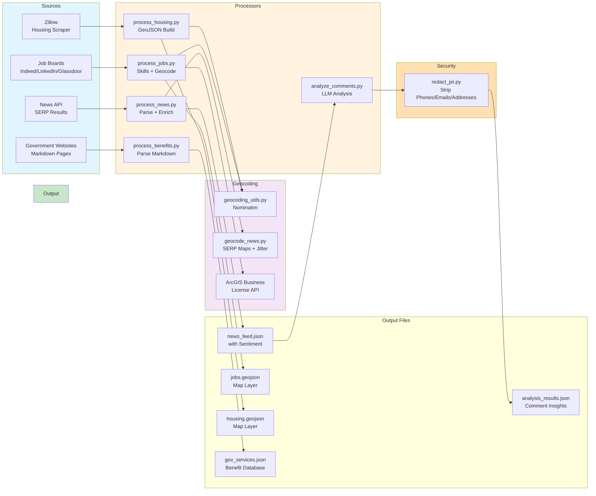

# Processors Module

Data extraction, enrichment, and transformation pipeline for news, jobs, housing, and benefits data.

This module converts raw data from scrapers and APIs into structured, enriched outputs ready for the frontend map and analysis systems. Each processor handles its own domain (news, jobs, housing, benefits) with common patterns: parse, enrich, geocode, deduplicate, save.

## Processing Pipeline

## File Reference

| File | Purpose |
|------|---------|
| `analyze_comments.py:63` | Batch LLM analysis of news comments using Gemini structured output and sentiment scoring. |
| `geocode_news.py:187` | 3-tier geocoding for news articles: specific locations via SERP Maps, city-level mentions via jittered center, fallback for all Montgomery articles. |
| `geocoding_utils.py:8` | Nominatim OpenStreetMap API wrapper for address-to-coordinate resolution. |
| `process_benefits.py:74` | Markdown table/list parsing to extract eligibility, income limits, and application steps from government benefit pages. |
| `process_housing.py:29` | Zillow listing transformation into GeoJSON features with price formatting and geocoding. |
| `process_jobs.py:84` | Job posting pipeline: skill extraction from descriptions, ArcGIS business license geocoding, deduplication by title/company/URL. |
| `process_news.py:21` | SERP news result parsing, sentiment enrichment via sentiment rules, deduplication by title/URL. |
| `redact_pii.py:17` | Regex-based removal of phone numbers, emails, and street addresses before LLM processing. |
| `schemas.py:24` | Pydantic models for comment and article analysis results shared by batch chain and API. |

## Processing Flows

### News Pipeline
1. **Parse** SERP results → extract title, URL, snippet, source, date
2. **Enrich** with sentiment score and misinformation risk via rule-based scoring
3. **Deduplicate** by article ID (hash of title + URL)
4. **Geocode** news locations using 3-tier strategy (specific location → SERP Maps, city mention → jittered center)
5. **Save** to `news_feed.json` with sentiment and metadata

### Job Pipeline
1. **Detect source** from raw job structure (LinkedIn/Glassdoor/Indeed)
2. **Tag** with source and generate stable ID
3. **Extract skills** from job description using keyword category matching
4. **Geocode** via ArcGIS Business License (company) or Nominatim (address)
5. **Build GeoJSON** features with skills, salary, location, source
6. **Dedup** by ID; merge with existing; append to history

### Housing Pipeline
1. **Parse** Zillow listing fields (address, price, beds, baths, status)
2. **Geocode** missing coordinates via Nominatim
3. **Format prices** and normalize property types
4. **Build GeoJSON** features with property metadata
5. **Dedup** by ID; merge with existing file

### Benefits Pipeline
1. **Load** markdown from government website scrape
2. **Parse tables** for income limits by household size
3. **Extract lists** of eligibility, application steps, required documents
4. **Pull provider** name, phone, URL
5. **Merge** live-scraped services with fallback file (live wins on ID)
6. **Save** structured benefit data to `gov_services.json`

### Comment Analysis Pipeline
1. **Load** articles and comments from existing JSON files
2. **Redact PII** from comment text (phones, emails, addresses)
3. **Batch invoke** Gemini with article + comments via LangChain chain
4. **Get structured output** including sentiment breakdown, urgent concerns, recommendations
5. **Log metrics** (latency, comment count, model version)
6. **Save** analysis results to `analysis_results.json`

## Key Patterns

**Deduplication**: All data sources use stable ID hashing (MD5 of unique fields). Existing records with matching IDs are replaced; new IDs are added.

**Geocoding Strategy**: Multi-tiered fallback (precise API → general location → skip) minimizes API costs while ensuring coverage.

**PII Redaction**: Regex strips sensitive patterns before feeding comments to LLM. Matches: `XXX-XXX-XXXX`, `user@domain.com`, `123 Street St`.

**GeoJSON Output**: All map layers (jobs, housing) export to standard GeoJSON FeatureCollection with lat/lng in geometry and properties for popup/filtering.

**Sentiment & Enrichment**: News articles get rule-based sentiment scores; comments get LLM analysis with Gemini structured output.

## Usage Notes

- **Geocoding APIs**: Nominatim (free, rate-limited); ArcGIS (business license data); SERP Maps (Bright Data).
- **LLM Analysis**: Gemini 3.1 Flash Lite for batch comment processing; temperature=0 for reproducibility.
- **Output Format**: All data saved as JSON or GeoJSON; GeoJSON follows RFC 7946 spec for map compatibility.
- **Error Handling**: Processors skip records with missing required fields; log to console or metrics file for review.
- **Idempotent Operations**: Safe to re-run processors; deduplication ensures no duplicates in output.

## Dependencies

- `langchain_google_genai`: Gemini LLM integration for batch analysis
- `backend.config`: OUTPUT_FILES paths and configuration
- `backend.core.bright_data_client`: SERP Maps API client
- `backend.core.sentiment_rules`: Rule-based sentiment scoring
- `pydantic`: Schema validation for LLM structured output
