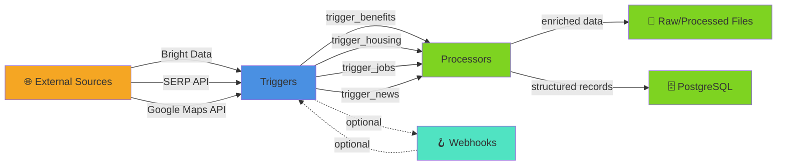

# Triggers

Data discovery layer that scrapes external sources (government sites, job boards, news) and feeds results to processors.

## Overview

Triggers are standalone CLI entry points that:
1. Call external APIs or web scrapers (Bright Data, SERP API)
2. Optionally poll for results or deliver via webhook
3. Pass raw data to processors for enrichment and storage

Each trigger is independent and can run on demand or on a schedule. Results flow to processors in `backend/processors/`.

## Architecture



## Files

| File | Purpose |
|------|---------|
| `trigger_benefits.py` | Scrape Alabama Medicaid/SNAP/TANF eligibility via Web Unlocker |
| `trigger_housing.py` | Scrape Zillow rental listings in Montgomery via Bright Data Scraper |
| `trigger_jobs.py` | Scrape Indeed/LinkedIn/Glassdoor job postings via Bright Data Scraper |
| `trigger_news.py` | Discover & fetch Montgomery news via SERP API + Web Unlocker + Google Maps geocoding |

## Usage

### Run a Trigger

**Fire-and-forget** (webhook delivery):
```bash
python -m backend.triggers.trigger_benefits --webhook http://localhost:8787/webhook/benefits
python -m backend.triggers.trigger_housing --webhook http://localhost:8787/webhook/housing
python -m backend.triggers.trigger_jobs --webhook http://localhost:8787/webhook/jobs
python -m backend.triggers.trigger_news --webhook http://localhost:8787/webhook/news
```

**Synchronous poll** (process and save immediately):
```bash
python -m backend.triggers.trigger_benefits --poll
python -m backend.triggers.trigger_housing --poll
python -m backend.triggers.trigger_jobs --poll
python -m backend.triggers.trigger_news --poll
```

### Optional Flags

**trigger_news** supports additional filtering:
```bash
--skip-fulltext    # Skip Web Unlocker article fetch (keep snippets only)
--skip-geocode     # Skip Google Maps geocoding step
```

## Execution Flow

### Benefits Trigger
1. Fetch Alabama Medicaid, SNAP, TANF pages via Web Unlocker (markdown format)
2. Parse markdown into structured eligibility rules and income limits
3. Merge with fallback data if scrape fails
4. Save to `data/processed/benefits.json`

### Housing Trigger
1. Trigger Zillow scraper (Montgomery, AL rentals)
2. Poll snapshot for raw listings
3. Extract features (location, price, beds, baths)
4. Save to `data/processed/housing.json`

### Jobs Trigger
1. Trigger Indeed, LinkedIn, Glassdoor scrapers in parallel
2. Poll each snapshot for raw job postings
3. Detect source and normalize fields
4. Build GeoJSON features
5. Save to `data/processed/jobs.json` + raw batches for debugging

### News Trigger
1. **Discover** via SERP API (multiple Montgomery-focused queries)
2. **Fetch** full article text via Web Unlocker (top N articles)
3. **Enrich** with sentiment, category, confidence
4. **Geocode** articles via Google Maps SERP
5. **Deduplicate** against existing articles
6. Save to `data/processed/news.json`

## Configuration

Trigger configuration is stored in `backend/core/payloads.py`:
- `BENEFITS_TARGETS` — government benefit URLs
- `JOB_SCRAPERS` — Indeed, LinkedIn, Glassdoor configs
- `NEWS_QUERIES` — Montgomery news search terms

Bright Data dataset IDs are in `backend/config.py`:
- `DATASETS["zillow"]`
- `DATASETS["indeed"]`, etc.

## Integration Points

### With Processors
Each trigger's raw output is consumed by a corresponding processor:
- `trigger_benefits` → `process_benefits.parse_benefit_markdown()`
- `trigger_housing` → `process_zillow_listings()`
- `trigger_jobs` → `process_jobs()`
- `trigger_news` → `parse_news_results()`, `geocode_articles()`

### With External Services
- **Bright Data**: Web Unlocker (HTML→markdown), Web Scraper API (discover listings)
- **SERP API**: Google News search, Google Maps geocoding
- **Webhooks**: Optional async result delivery

## Notes

- **Bright Data rate limiting**: Triggers sleep 2s between requests to respect API quotas
- **Fallback data**: Benefits trigger has hardcoded fallback if scrape fails
- **Webhook mode**: Results are delivered asynchronously; no local save
- **Raw output**: Jobs trigger saves intermediate results to `data/raw/` for debugging
