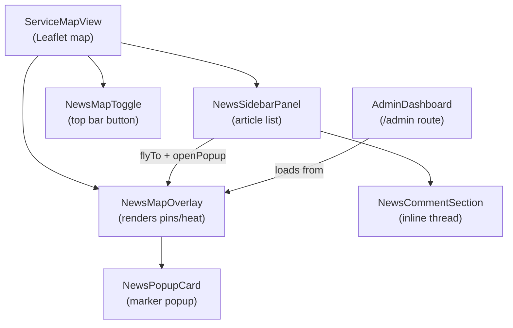
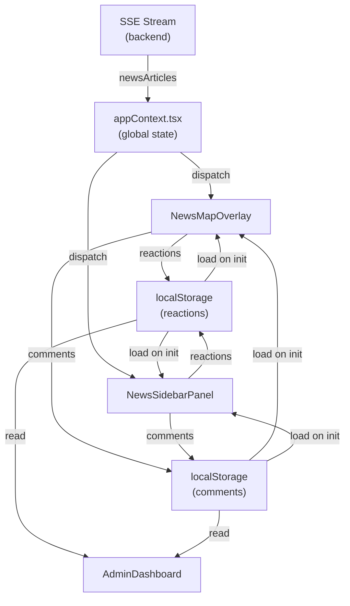
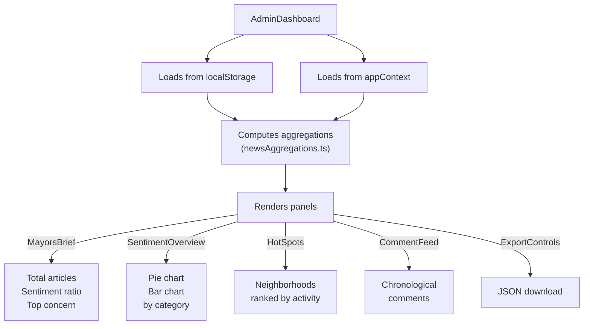

# News Sentiment System Architecture

## Overview

The news sentiment feature adds a community-driven intelligence layer to Montgomery Navigator. It combines real-time news discovery, AI sentiment analysis, geographic mapping, and civic engagement (reactions + comments) into a unified experience for residents and city officials.

## Data Pipeline

```mermaid
graph LR
    A["Google News SERP<br/>(Bright Data)"]
    B["News Discovery<br/>(trigger_news.py)"]
    C["Full-Text Fetch<br/>(Bright Data crawl)"]
    D["Sentiment Enrichment<br/>(process_news.py)"]
    E["Geocoding<br/>(geocode_news.py)"]
    F["Deduplication<br/>&amp; Save"]
    G["SSE Stream"]
    H["Frontend"]

    A -->|JSON: URLs, titles| B
    B -->|Persist URLs| C
    C -->|Markdown content| D
    D -->|+sentiment score| E
    E -->|+lat/lng| F
    F -->|Push to broadcast| G
    G -->|SSE event| H
```



### 1. News Discovery (trigger_news.py)

- **Input**: 22 Google News queries (general, gov, development, community, events)
- **API**: Bright Data SERP API via WebUnlocker SDK
- **Output**: Article metadata (title, URL, source, snippet, timestamp)
- **Rate**: 1 cycle per configured interval (default: 15 minutes)
- **Fallback**: If rate-limited, uses cached results

### 2. Full-Text Fetch (optional, --skip-fulltext)

- **Input**: Top N articles from discovery (rate-limited to 10/cycle for speed)
- **API**: Bright Data crawl_single_url
- **Output**: Full article text (truncated to 2000 chars)
- **Storage**: Markdown format for readability
- **Config**: `MAX_ARTICLES_TO_FETCH` environment variable

### 3. Sentiment Analysis (process_news.py)

- **Input**: Article title + excerpt
- **Method**: Keyword-based classification (no LLM calls)
  - Positive keywords: "growth", "investment", "opportunity", "recovery"
  - Negative keywords: "crisis", "layoff", "danger", "accident", "shutdown"
  - Default: "neutral"
- **Output**: Sentiment score (-1 to +1)
- **Deterministic**: Same article always gets same sentiment

### 4. Geocoding (geocode_news.py)

3-tier strategy ensures 100% map coverage:

| Tier | Trigger | Method | Precision | Examples |
|------|---------|--------|-----------|----------|
| 1 | Specific location (28 neighborhoods, 20+ landmarks, streets) | Bright Data Google Maps SERP | High | "Old Cloverdale", "Dexter Ave", "ASU Stadium" |
| 2 | City-level mention (keywords + proper nouns) | Jittered city center | Medium | "Montgomery", "State Capitol", "Alabama State" |
| 3 | No specific mention (all articles are Montgomery-relevant by design) | Jittered city center | Medium | Fallback for all remaining |

**Jittering Details**:
- Deterministic: Uses MD5 hash(article_id) to generate angle + radius
- Spreads pins across downtown (0.02° radius ≈ 2 km)
- Prevents stacking; ensures same article always maps to same pin
- Example: article-123 always maps to (32.367, -86.300) ± jitter

**Bounding Box Validation**:
- SERP results must fall within Montgomery metro (32.20–32.55 lat, -86.55 to -86.10 lng)
- Out-of-bounds results are discarded (logged as warning)

**API Rate Limiting**:
- Max 500 SERP calls per cycle (configurable `max_geocode` param)
- Skips Tier 1 if quota exhausted; falls back to Tier 2

### 5. Deduplication & Storage

- **Dedup key**: Hash(title + source)
- **Merge logic**: New articles added; existing articles updated (if newer)
- **Location preservation**: Already-geolocated articles skip re-processing
- **Output**: `montgomery-navigator/public/data/news_feed.json`

## Frontend Architecture

### Component Hierarchy



### Data Flow



### State Management

**Global App State** (`src/lib/appContext.tsx`):

```typescript
interface AppState {
  // News data
  newsArticles: NewsArticle[];           // All articles from SSE
  newsComments: NewsComment[];           // Comments (synced from localStorage)
  newsReactions: Record<string, Record<ReactionType, number>>;  // Aggregate counts
  userReactions: Record<string, ReactionType>;  // This user's reaction per article
  newsMapMode: "pins" | "heat";         // Display mode

  // ... other state (services, cv, etc.)
}
```

**Actions**:
- `SET_NEWS_COMMENTS` — Bulk load from localStorage on mount
- `SET_ARTICLE_REACTION` — Toggle user reaction, update counts
- `SET_NEWS_COMMENT` — Add comment to state
- `SET_NEWS_MAP_MODE` — Switch pins ↔ heat

### Persistence Layer

**Reactions** (`newsReactionStore.ts`):
- Key: `montgomery-news-reactions`
- Format: `{reactions: {articleId: {type: count}}, userReactions: {articleId: type}}`
- Load: On NewsMapOverlay mount
- Save: useEffect watches `state.newsReactions` + `state.userReactions`

**Comments** (`newsCommentStore.ts`):
- Key: `montgomery-news-comments`
- Format: NewsComment[] (array)
- Load: On NewsMapOverlay mount
- Save: useEffect watches `state.newsComments`
- Export: `exportCommentsAsJson()` — Triggers browser download of JSON with comments + reactions + articles

## Admin Dashboard

**Route**: `/admin`

Aggregates all data sources into a single view for city officials.



**Data Aggregation Functions** (`newsAggregations.ts`):

```typescript
computeSentimentBreakdown(articles: NewsArticle[])
// Returns: {positive: N, neutral: N, negative: N}

computeNeighborhoodActivity(articles: NewsArticle[], reactions: Reactions, comments: NewsComment[])
// Returns: {neighborhood: string, count: N, avgSentiment: string, reactions: N, comments: N}[]
// Ranked by count desc

sortArticlesByEngagement(articles: NewsArticle[], reactions: Reactions, comments: NewsComment[])
// Returns: articles sorted by (reactions + comments) desc
```

## Map Visualization

### Pins Mode

- **Marker per article**: DivIcon with HTML
- **Color**: Sentiment (green/yellow/red)
- **Size**: 30px circle
- **Icon**: 📰 (newspaper emoji)
- **Popup**: NewsPopupCard on click

### Heat Mode

- **CircleMarker per article**: Canvas-rendered circle
- **Color**: Sentiment
- **Radius**: 30px (fixed)
- **Opacity**: 20% fill, 40% stroke
- **Popup**: Same NewsPopupCard on click

**Toggle**: NewsSidebarPanel header buttons switch between modes

## File Structure

```
src/
├─ lib/
│  ├─ newsMapMarkers.ts              # Sentiment colors, marker factories
│  │  └─ createNewsMarker()          # DivIcon factory
│  │  └─ buildClusterMarkerHtml()    # Cluster display
│  │  └─ computeAverageSentiment()   # Aggregate sentiment
│  │  └─ filterGeolocatedArticles()  # Filter to only mapped articles
│  │
│  ├─ newsReactionStore.ts           # localStorage wrapper
│  │  └─ loadStoredReactions()
│  │  └─ saveReactions()
│  │
│  ├─ newsCommentStore.ts            # localStorage wrapper + export
│  │  └─ loadStoredComments()
│  │  └─ saveComment()
│  │  └─ saveAllComments()
│  │  └─ exportCommentsAsJson()
│  │
│  ├─ newsAggregations.ts            # Trending, neighborhood logic
│  │  └─ sortArticlesByEngagement()
│  │  └─ computeSentimentBreakdown()
│  │  └─ computeNeighborhoodActivity()
│  │
│  ├─ types.ts                       # NewsArticle, NewsComment, etc.
│  ├─ appContext.tsx                 # Global state + dispatch
│  └─ newsService.ts                 # Utils (formatRelativeTime, etc.)
│
├─ components/app/
│  ├─ news/
│  │  ├─ NewsMapOverlay.tsx          # Main map integration
│  │  ├─ NewsMapToggle.tsx           # Toggle button
│  │  ├─ NewsPopupCard.tsx           # Marker popup
│  │  ├─ NewsSidebarPanel.tsx        # Right-side article list
│  │  ├─ SidebarArticleRow.tsx       # Individual article row
│  │  ├─ NewsCommentSection.tsx      # Inline comment thread
│  │  ├─ NewsSentimentLegend.tsx     # Color legend
│  │  ├─ NewsCard.tsx                # Article card variant
│  │  ├─ NewsFilterBar.tsx           # Sort + filter controls
│  │  ├─ NewsCategoryTabs.tsx        # Category selector
│  │  ├─ NewsView.tsx                # Fallback standalone view
│  │  ├─ NewsDetail.tsx              # Detail view
│  │  ├─ TrendingTab.tsx             # Trending sorting
│  │  ├─ TrendingArticleItem.tsx     # Trending article row
│  │  └─ NeighborhoodsTab.tsx        # Neighborhood breakdown
│  │
│  ├─ admin/
│  │  ├─ SentimentOverview.tsx       # Pie + bar charts
│  │  ├─ HotSpotsPanel.tsx           # Neighborhood table
│  │  ├─ MayorsBrief.tsx             # Summary stats
│  │  ├─ CommentFeed.tsx             # Comment thread
│  │  └─ ExportControls.tsx          # JSON download
│  │
│  ├─ FlowSidebar.tsx                # Left nav (with /admin button)
│  └─ ...
│
└─ pages/
   ├─ CommandCenter.tsx              # Main app shell
   ├─ AdminDashboard.tsx             # /admin route
   └─ ...

scripts/
├─ triggers/
│  └─ trigger_news.py                # News discovery pipeline
│
├─ processors/
│  ├─ process_news.py                # Sentiment enrichment
│  └─ geocode_news.py                # Geocoding (3-tier)
│
├─ scrape_scheduler.py               # Async job runner
└─ ...
```

## Performance Considerations

### Frontend

- **Map Rendering**: Leaflet + react-leaflet handles 200+ markers efficiently (canvas rendering)
- **Sidebar Scrolling**: ScrollArea component virtualizes long lists
- **localStorage**: ~5-10 MB limit; admin export recommended at 500+ comments
- **Admin Dashboard**: 2s load time (aggregation is O(n) on comments/articles)

### Backend

- **SERP API Calls**: 22 queries × ~10 results = 220 articles per cycle
- **Geocoding Cost**: ~500 SERP calls per cycle (max configurable)
- **Bright Data Quota**: Monitor SERP API usage in dashboard
- **SSE Broadcasting**: ~100 KB per broadcast (all articles + metadata)

## Security & Privacy

- **No User Auth**: Anonymous reactions + comments
- **No PII Logging**: Comments capture user-provided names (not emails/IPs)
- **localStorage Only**: No backend database = no data breaches
- **Export JSON**: Contains comments, reactions, articles—downloadable by admin only
- **Future**: Implement admin authentication before storing comments in backend

## Testing Strategy

- **Unit**: Geocoding tiers, sentiment classification, aggregation functions
- **Integration**: localStorage sync, map rendering, component interactions
- **Manual**: Admin export, sidebar filtering, reaction updates
- **E2E**: User journey (discover article → react → comment → export)

## Deployment Checklist

- [ ] Frontend build passes (npm build)
- [ ] Map renders with 100% geolocated articles
- [ ] Sidebar sort/filter works
- [ ] Reactions persist across page reload
- [ ] Comments persist across page reload
- [ ] Admin dashboard loads < 2s
- [ ] JSON export works
- [ ] No console errors
- [ ] No localStorage quota warnings (at current data size)
