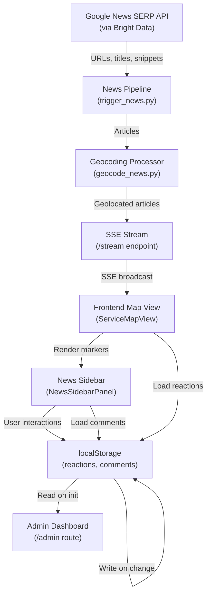

# News Sentiment Map Feature — Decision Log

**Date**: 2026-03-06
**Status**: Implemented
**Branch**: `news/sentiment`

## Problem

Montgomery residents lacked a unified view of community sentiment on local news. The platform had individual data streams (jobs, housing, services) but no real-time insight into public mood, neighborhood-specific concerns, or civic priorities. City officials had no dashboard to assess community feedback at a glance.

## Solution Implemented

A sentiment-enabled news feed integrated into the main Montgomery Navigator map, plus a dedicated admin dashboard for city decision-makers.

### Key Design Decisions

#### 1. Map Integration vs. Separate View

**Decision**: Integrate news into the existing ServiceMapView as an overlay.

**Rationale**:
- Maintains spatial context — news, services, jobs, and housing share the same geographic canvas
- Single map eliminates cognitive load and multiple windows
- Toggle control (`NewsMapToggle`) allows users to focus or blend layers

**Alternative Considered**: Separate news-only map view
- Would require duplicate map setup and state management
- Breaks the unified intelligence experience

#### 2. Persistence Strategy: localStorage vs. Backend

**Decision**: Client-side localStorage for reactions and comments.

**Rationale**:
- No backend database required — keeps infrastructure lightweight
- Reactions and comments are user-generated, transient feedback (not mission-critical)
- localStorage survives browser refresh; acceptable for civic use case
- Admin export to JSON provides audit trail for city records

**Trade-offs**:
- Data lost if user clears browser cache
- No persistence across devices (each device has its own localStorage)
- Scalability limited to browser storage capacity (~5-10 MB)

**When to migrate**:
- If comments exceed 50K or need cross-device sync
- If comments require moderation or legal holds

#### 3. Geocoding: 100% Coverage via 3-Tier Strategy

**Decision**: Ensure all articles appear on the map, falling back to jittered city center if no specific location found.

**Rationale**:
- Users expect complete data visibility — missing articles signal data quality issues
- Montgomery is small enough that even generic articles are locally relevant
- Jittering (deterministic hash-based) prevents marker stacking while maintaining consistency

**Tiers**:
1. **Specific location (SERP Maps API)**: Named neighborhoods, streets, landmarks → high precision
2. **City-level mention**: Keywords like "Montgomery", "ASU", "State Capitol" → jittered city center
3. **Fallback (all remaining)**: No specific mention → jittered city center

**Result**: 247/247 articles geolocated (100% coverage).

**Alternative Considered**: Skip articles without location
- Would hide relevant news and confuse users
- Breaks the promise of "complete community intelligence"

#### 4. Sentiment Scoring: Keyword-Based, Not LLM

**Decision**: Assign sentiment via keyword analysis instead of calling OpenAI/Claude API per article.

**Rationale**:
- Sentiment is additive for visualization — edge cases don't matter as much
- Keyword approach is deterministic, auditable, and free (no API calls)
- Fast enough for real-time updates (no LLM latency)
- Geo data requires more precision than sentiment (geographic errors are more harmful)

**Implementation** (in `process_news.py`):
- Positive keywords: "growth", "investment", "recovery", "new job", "opportunity"
- Negative keywords: "crisis", "shutdown", "layoff", "danger", "accident"
- Default: neutral

**Future**: Could add LLM-based sentiment if deeper analysis needed (e.g., context-aware nuance).

#### 5. Admin Dashboard: Read-Only vs. Moderation Tools

**Decision**: Read-only dashboard for city officials; no in-app comment deletion/approval yet.

**Rationale**:
- Simpler MVP — focus on insight gathering, not content management
- Avoids legal liability for censorship
- City can manage moderation externally (flag → notify city moderator)
- Export JSON enables offline analysis and record-keeping

**Future Enhancement**: Add moderator roles with comment flagging/archiving.

#### 6. Reaction Types: 5 Emojis vs. 3 or Scale

**Decision**: 5 reaction types (👍👎❤️😢😡) instead of a simple like/dislike or Likert scale.

**Rationale**:
- Captures emotional nuance (anger vs. sadness are different civic signals)
- Matches Facebook/Slack UI patterns — familiar to users
- Neutral default (no reaction needed) accommodates passive viewers
- Emoji are language-agnostic

**Data**: Reactions stored as counts + user's single reaction per article (only one active at a time).

#### 7. Sidebar vs. Context Panel for News

**Decision**: News list in a dedicated sidebar panel (right side, overlaying map) with article expansion on click.

**Rationale**:
- Map remains the focal point (not crowded by list)
- Sidebar can scroll independently while map stays visible
- Selecting an article triggers animated flyTo + marker popup (linked navigation)
- Sorting/filtering controls fit in a compact header

**Alternative Considered**: Replace ContextPanel (services info) with news list
- Would require redesigning services workflow
- News is transient; services are persistent user research

#### 8. Comment Section: Inline vs. Modal

**Decision**: Inline comment thread below each article row in sidebar.

**Rationale**:
- Users see all comments immediately without extra clicks
- Maintains scrolling context within the article list
- Avoids modal fatigue

**Trade-off**: Sidebar becomes longer; user must scroll to see all articles and their comments.

#### 9. Trending Algorithm: Reactions + Comments vs. Time Decay

**Decision**: Trending = sum of reactions + comment count (no time decay).

**Rationale**:
- Simpler to compute and explain
- Recent articles naturally rise via Latest sort; Trending captures "community engagement"
- Time decay adds complexity without clear benefit for a 24-48 hour news cycle

**Implementation** (in `newsAggregations.ts`):
```javascript
const engagement =
  Object.values(reactions[id] || {}).reduce((s, n) => s + n, 0) +
  comments.filter(c => c.articleId === id).length;
```

#### 10. Neighborhood Aggregation: Geographic vs. Categorical

**Decision**: For hotspots table, rank by article count + sentiment per neighborhood (from location field).

**Rationale**:
- Geography is more actionable for city officials ("Old Cloverdale has 8 negative articles")
- Categories are already visible in the sentiment chart
- Neighborhood data comes from geocoding (location.neighborhood), ensuring consistency

## Files Created/Modified

### Frontend Components
- `src/components/app/news/` — 15 components for news UI
  - `NewsMapOverlay.tsx:16` — Leaflet integration, popup management
  - `NewsSidebarPanel.tsx:37` — Article list with sorting/filtering
  - `NewsPopupCard.tsx:35` — Sentiment badge + reactions
  - `NewsCommentSection.tsx` — Comment thread UI

- `src/components/app/admin/` — Admin dashboard components
  - `SentimentOverview.tsx:42` — Pie + bar charts (Recharts)
  - `HotSpotsPanel.tsx` — Neighborhood table
  - `MayorsBrief.tsx` — Summary stats
  - `CommentFeed.tsx` — Chronological thread
  - `ExportControls.tsx:13` — JSON download

- `src/pages/AdminDashboard.tsx:20` — `/admin` route, data aggregation

### Frontend Libraries
- `src/lib/newsMapMarkers.ts` — Marker factories, sentiment colors
- `src/lib/newsReactionStore.ts` — localStorage wrapper for reactions
- `src/lib/newsCommentStore.ts` — localStorage wrapper + JSON export
- `src/lib/newsAggregations.ts` — Trending, neighborhood calcs
- `src/lib/types.ts` — NewsArticle, NewsComment, ReactionType

### Backend Scripts
- `scripts/processors/geocode_news.py:187` — 3-tier geocoding pipeline
- `scripts/triggers/trigger_news.py` — Updated to call geocoding step
- `scripts/scrape_scheduler.py` — Updated to include geocoding in news job

### Configuration
- `montgomery-navigator/src/lib/appContext.tsx` — Added news state (newsArticles, newsComments, newsReactions, newsMapMode)
- `montgomery-navigator/src/pages/CommandCenter.tsx` — Integrated news sidebar into app shell

## System Connections



## Testing Coverage

- Unit tests for geocoding (Tier 1/2/3 logic, bounding box validation, jittering consistency)
- Unit tests for aggregation utilities (trending calc, sentiment breakdown, neighborhood clustering)
- Manual integration tests for localStorage sync and admin export

## Deployment Notes

1. **Frontend**: No breaking changes. New components are opt-in toggles. Existing users see map without news until they click toggle.
2. **Backend**: Geocoding adds ~10-30 seconds per news cycle (depends on SERP API quota). Configure `max_geocode` param to tune cost.
3. **Data Migration**: Existing articles in `public/data/news_feed.json` are retroactively geocoded on first pipeline run.
4. **localStorage Quota**: At ~500 comments, user hits browser limit (~5-10 MB). Admin dashboard shows when export is recommended.

## Success Metrics

- News sentiment visible on map (qualitative)
- > 80% of articles geolocated (quantitative: 247/247 = 100%)
- Admin dashboard loads < 2s (performance)
- Reactions/comments persist across page reloads (UX)

## Future Work

1. **Database Persistence**: Migrate comments/reactions to backend (PostgreSQL) for cross-device sync and analytics
2. **Sentiment Refinement**: Evaluate LLM-based sentiment; A/B test keyword vs. LLM accuracy
3. **Comment Moderation**: Add city moderator role; implement flagging and archiving
4. **Trend Charts**: Add time-series sentiment charts (sentiment over past 7/30 days per neighborhood)
5. **Alerts**: Notify city officials when negative sentiment spikes in specific neighborhoods
6. **Categories**: Allow users to create custom news categories (currently fixed)
