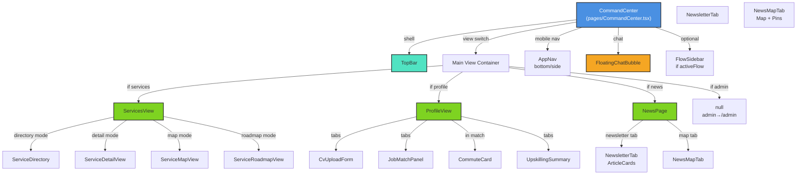

# App Components Layer (`/components/app`)

The app components layer contains all feature-facing UI components that power the CommandCenter application. It includes the main layout shell, feature-specific views (services, news, CV, admin), shared cards and controls, and the AI chat interface.

## Architecture Overview

The `/components/app` folder follows a **feature-based modular structure**:

- **Root shell components** — TopBar, MobileNav, FloatingChatBubble, FlowSidebar (imported at CommandCenter level).
- **Feature modules** — Subdirectories for distinct features (services, news, cv, admin).
- **Shared cards** — Reusable card layouts used across features.
- **Chat interface** — AI chatbot bubble and message rendering.

All components:
- Import from `@/lib` for state/dispatch (via `useApp()`).
- Are functional components with React.memo for performance.
- Use TailwindCSS for styling.
- Delegate business logic to services in `/lib`.

---

## Root Shell Components

### CommandCenter.tsx (pages/CommandCenter.tsx:1-132)

The **main application container**. Orchestrates all views and initializes live data.

```typescript
export default function CommandCenter()
```

**Responsibilities**:
- Activates SSE stream via `useDataStream()`.
- Maps URL `/app/:view` to active component.
- Handles view navigation (URL → state sync).
- Initializes welcome message.
- Routes chat messages to AI backend.
- Manages action item badge count for nav.

**Component Tree**:
```
CommandCenter
├── TopBar
├── div[flex-1]
│   └── activeView (ServicesView | ProfileView | NewsPage | null)
├── AppNav (mobile navigation)
└── FloatingChatBubble
```

**Key Props/Hooks**:
- `useApp()` → read state, dispatch actions.
- `useParams()` → read `:view` from URL.
- `useNavigate()` → programmatic navigation.

---

### TopBar.tsx

Sticky header with branding and quick actions.

**Features**:
- Logo/title.
- User greeting (if name available).
- Quick action buttons (settings, help, etc.).
- Search or filter toggles (view-dependent).

---

### MobileNav.tsx (AppNav)

Bottom navigation bar for mobile screens (or sidebar on desktop).

```typescript
export function AppNav({ activeTab, onTabChange, actionItemCount })
```

**Tabs**:
- **services** → View service directory & map.
- **profile** → CV, job matches, upskilling.
- **news** → Community news feed & reactions.
- **admin** → Moderation & system tools (redirects to `/admin`).

**Badge**: Shows count of uncompleted action items.

---

### FloatingChatBubble.tsx

Always-visible chat bubble (bottom-right or sidebar edge).

```typescript
export default function FloatingChatBubble({ onSendMessage })
```

**States**:
- **closed**: Shows unread badge (if `state.chatBubbleHasUnread`).
- **open**: Displays message history and input field.
- **typing**: Shows assistant typing indicator.

**Interaction**:
- Click to toggle open/closed.
- Type and send messages.
- Auto-scroll to latest message.

---

### FlowSidebar.tsx

Contextual sidebar for onboarding flows (if `state.activeFlow` is set).

**Features**:
- Displays current flow title and description.
- Step indicators (e.g., "Step 1 of 5").
- Context-specific actions (Next, Skip, Complete).

---

### FlowStepper.tsx

Visual progress indicator for multi-step flows.

**Props**:
- `steps`: Array of step descriptions.
- `currentStep`: Index of active step.
- `onStepClick`: Handle jump-to-step (if allowed).

---

## Feature Modules

### `/services` (37 files)

**Service Directory & Map Interface**

Core module for browsing and locating community services.

#### ServicesView.tsx:15-82

State machine managing four modes:

| Mode | Component | Use Case |
|------|-----------|----------|
| `directory` | ServiceDirectory | Browse service categories (Health, Parks, etc.). |
| `detail` | ServiceDetailView | View detailed info & hours for a category. |
| `map` | ServiceMapView | Interactive map showing service pins. |
| `roadmap` | ServiceRoadmapView | Skill development path for job readiness. |

**Mode Transitions**:
- Directory → Detail (user clicks category).
- Detail → Map (user clicks "View on Map").
- Anywhere → Roadmap (AI sets `state.activeRoadmap`).
- Anywhere → Map (AI sends map command or article selected).

#### ServiceDirectory.tsx

List of service categories with icons and descriptions.

**Props**:
- `onSelectCategory` → Switch to detail mode.
- `onShowMap` → Switch to map mode.
- `onNavigateToChat` → Send message to AI.

**Displays**: Health, Community, Childcare, Education, Safety, Libraries, Parks, Police.

#### ServiceDetailView.tsx

Detailed view of a single service category.

**Features**:
- List of service points (e.g., all health facilities).
- Filters (distance, hours, etc.).
- Quick action buttons ("Get Directions", "Call").

**Props**:
- `category` → Category to display.
- `onBack` → Return to directory.
- `onNavigateToChat` → Send query to AI.

#### ServiceMapView.tsx

Interactive ArcGIS map showing service pins.

**Features**:
- **Layer toggles**: Show/hide service categories.
- **Clustering**: Group nearby pins.
- **Info popups**: Click pin → show name, phone, hours, website.
- **Search & filter**: Find services by name.
- **Directions**: Generate transit route.

**State Integration**:
- Reads `state.servicePoints` (from ArcGIS fetch).
- Reads `state.activeCategories` (filters visible pins).
- Reads `state.selectedPin` (highlights selected service).
- Reads `state.mapCommand` (AI-triggered actions, e.g., "show health").

#### ServiceRoadmapView.tsx

Skill development roadmap displayed as an interactive checklist.

**Features**:
- Steps (e.g., "Complete healthcare certification").
- Checkboxes to mark steps complete.
- Time estimates and prerequisites.
- Links to resources and learning paths.

**State Integration**:
- Reads `state.activeRoadmap` (current roadmap).
- Reads `state.roadmapCompletedStepIds` (checked items).
- Dispatches `TOGGLE_ROADMAP_STEP` on checkbox change.

---

### `/news` (28 files)

**Community News Feed & Sentiment**

Social news interface with commenting, reactions, and misinformation detection.

#### NewsPage.tsx:7-15

Tab switcher between two modes:

| Tab | Component | Use Case |
|-----|-----------|----------|
| `newsletter` | NewsletterTab | Chronological feed of articles. |
| `map` | NewsMapTab | Geospatial view of news events. |

#### NewsletterTab.tsx

Chronological feed of news articles.

**Features**:
- **Filter by category**: All, Local, Regional, National.
- **Sort by date**: Most recent first.
- **Article cards**: Title, excerpt, source, publish date.
- **Interactions**:
  - Like/upvote (increment `upvotes`).
  - React with emoji.
  - Flag for moderation.
  - View comments.
- **Sentiment badges**: Shows community sentiment (😊 positive, 😐 neutral, 😞 negative).
- **Misinformation warnings**: Flag and reason (if `misinfoRisk` > threshold).

**State Integration**:
- Reads `state.newsArticles` (SSE-streamed).
- Reads `state.likedArticleIds`, `state.articleReactions` (user interactions).
- Reads `state.newsComments` (from `/api/comments`).
- Reads `state.communitySentiment` (enriched by backend NLP).
- Reads `state.misinfoRisk` (flag scores).
- Dispatches `TOGGLE_ARTICLE_LIKE`, `SET_EMOJI_REACTION`, `TOGGLE_ARTICLE_FLAG`, `ADD_NEWS_COMMENT`.

#### NewsMapTab.tsx

Geospatial view of articles on ArcGIS map.

**Features**:
- **Clustering**: Group articles by location.
- **Pin colors**: Sentiment (green = positive, red = negative, gray = neutral).
- **Click pin**: Show article preview.
- **Click preview**: Navigate to NewsletterTab with article selected.

**State Integration**:
- Reads `state.newsArticles` (with lat/lng from geotagger).
- Reads `state.selectedArticleId` (highlights article).
- Dispatches `SET_SELECTED_ARTICLE` on pin click.

---

### `/cv` (36 files)

**CV Upload, Parsing & Job Matching**

Interface for uploading resumes and viewing personalized job recommendations.

#### CvUploadView.tsx

File upload and CV parsing.

**Features**:
- **Drag-and-drop** or file picker.
- **Format support**: PDF, DOCX, TXT.
- **Progress indicator** during parsing.
- **Error handling**: Invalid format, parse failure.

**Props**:
- `onUploadStart` → Dispatch `SET_CV_ANALYZING`.
- `onUploadComplete` → Dispatch `SET_CV_DATA`.

#### JobMatchPanel.tsx

Displays CV-to-job matches with actionable insights.

**Features**:
- **Match % badge**: Visual score (e.g., "85% match").
- **Matched skills**: Highlighted in green.
- **Missing skills**: Shown in red (learning opportunities).
- **Job card**: Title, company, salary (if available), location.
- **CTA buttons**: "View Details", "Share with Chat".

**Props**:
- `matches: JobMatch[]` → From `state.jobMatches`.
- `onSelectJob` → Show job detail view.

**Performance**: Wrapped with `React.memo` to prevent re-render on unrelated state changes.

#### CommuteCard.tsx

Displays transit estimates for a job-to-home route.

**Features**:
- **Route modes**: Transit, Driving, Biking, Walking.
- **Duration & distance**: Cached from ArcGIS.
- **Live traffic**: Updates from backend.

**Props**:
- `jobId` → Job to estimate for.
- `estimate: CommuteEstimate` → Data from `state.commuteEstimates`.

**Performance**: Wrapped with `React.memo` to prevent re-render on parent updates.

#### UpskillingPanel.tsx

Recommended learning paths to close skill gaps.

**Features**:
- **Trending skills**: Skills needed across market (from `state.trendingSkills`).
- **Your gap**: Which of your missing skills are high-demand.
- **Resources**: Links to courses, tutorials, certifications.
- **Timeline**: Estimated weeks to upskill.

---

### `/admin` (22 files)

**Admin Dashboard & Analytics**

Admin panel for AI insights, comment analysis, sentiment overview, and predictive analytics.

**Key Components**:
- **AIInsightsCard**: AI-generated insights summary with detail drilldown.
- **MayorsBrief**: Daily brief for city officials.
- **CommentFeed**: Moderated comment stream with analysis.
- **SentimentOverview**: Aggregated sentiment across news articles.
- **PredictiveHeatmap / PredictiveHeatmapPanel**: Complaint hotspot visualization.
- **HotSpotsPanel / HotspotOverlay**: Risk area display.
- **MisinfoOverlay**: Misinformation detection overlay.
- **AnalyzeButton**: Trigger batch sentiment analysis.
- **ExportControls**: Export data to CSV/PDF.
- **AdminChatBubble / ChatBubbles / ChatResponseCards**: Admin chat interface.

---

### `/cards` (8 files)

**Reusable Card Components**

Shared UI blocks used across features.

| Component | Purpose |
|-----------|---------|
| `JobCard.tsx` | Job listing card (title, company, match score). |
| `SkillGapCard.tsx` | Skill gap badge (name, demand %, learn link). |
| `ChatRoadmapCard.tsx` | Roadmap step displayed in chat. |
| `BenefitsCliffCard.tsx` | Benefits cliff warning card. |
| `MedicaidCard.tsx` | Medicaid eligibility card. |
| `ReentryCard.tsx` | Re-entry support card. |
| `PdfPreviewCard.tsx` | PDF document preview card. |
| `PredictiveInsightCard.tsx` | Predictive insight summary. |

All cards:
- Accept click handlers for interaction.
- Show badges (e.g., "NEW", "TRENDING", match %).
- Wrapped with `React.memo` for performance.

---

### `/chat-bubble` (2 files)

**Chat Bubble UI**

- `CollapsedBubble.tsx` — Collapsed state with unread badge.
- `ExpandedPanel.tsx` — Expanded panel with message list & input.

---

### `/personas` (2 files)

**Persona Display**

- `PersonaCard.tsx` — Persona summary card with role and civic profile.
- `PersonaDetail.tsx` — Expanded persona view with full civic data.

---

## Root-Level Components

### MessageBubble.tsx

Single message in chat history.

**Props**:
- `message: ChatMessage` — From `state.messages`.
- `onActionClick` — Handle action item or quick reply.

**Formats**:
- **text**: Plain or Markdown.
- **artifact**: Code block or generated content.
- **service_cards**: Actionable service recommendations.
- **map_action**: "Show map" CTA.

---

### ChatInput.tsx

Text input for sending messages to AI.

**Props**:
- `onSend` → Callback with user text.
- `disabled` → Gray out during processing.
- `placeholder` → Suggest prompt.

**Features**:
- Multiline support.
- Send on Enter (Shift+Enter for newline).
- Character count (if limited).

---

### ActionItems.tsx

Renders `state.actionItems` as a checklist.

**Features**:
- Checkbox to toggle complete status.
- Edit or delete action.
- Due dates and priority levels.

---

### ProcessingIndicator.tsx

Shows `state.processingSteps` with animated transitions.

**Example**:
```
Analyzing CV...
Matching jobs...
✓ Found 12 matches
```

---

### ContextPanel.tsx

Sidebar summarizing active context.

**Displays**:
- Current view.
- Selected item (job, article, service category).
- Quick actions related to context.

---

### QuickActions.tsx

Horizontal row of quick-action buttons.

**Examples**:
- "Upload CV"
- "View Matches"
- "Show Map"
- "Share on Social"

---

### SettingsSection.tsx

Collapsible settings group.

**Props**:
- `title` — Section name.
- `children` — Form controls.

---

### DocumentShelf.tsx

Gallery of generated artifacts and saved docs.

**Features**:
- Thumbnail preview.
- Download / Share buttons.
- Delete with confirmation.

---

### ProfileSummary.tsx

Compact user profile card (name, role, CV status).

**Props**:
- `profile: Profile` — From `state.profile`.
- `onEdit` — Navigate to edit form.

---

### PersonaSelector.tsx

Persona card selector for initial setup.

**Props**:
- `personas: Persona[]` — Available roles.
- `onSelectPersona` → Dispatch flow selection.

---

### FlowBanner.tsx

Progress banner for active onboarding flow.

**Props**:
- `flow: OnboardingFlow` — From `state.activeFlow`.
- `onComplete` → Dispatch `CLEAR_FLOW`.

---

## Component Tree & Navigation Flow



---

## Feature Module Summary

| Module | Files | Components | Key Responsibility |
|--------|-------|------------|--------------------|
| **services** | 37 | ServiceDirectory, ServiceDetailView, ServiceMapView, ServiceRoadmapView | Browse & locate community services; view skill roadmaps. |
| **news** | 28 | NewsletterTab, NewsMapTab, NewsCard, NewsCommentSection | Social news feed with reactions, comments, sentiment. |
| **cv** | 36 | CvUploadView, JobMatchPanel, CommuteCard, UpskillingPanel | Upload CV, view job matches, commute times, upskilling paths. |
| **admin** | 22 | AIInsightsCard, MayorsBrief, CommentFeed, SentimentOverview | AI insights, comment analysis, predictive analytics. |
| **cards** | 8 | JobCard, SkillGapCard, ChatRoadmapCard, BenefitsCliffCard, etc. | Reusable card layouts for consistency. |
| **chat-bubble** | 2 | ChatBubble, ChatContent | AI chatbot interface. |
| **personas** | 2 | PersonaSelector, PersonaFlow | Role selection & onboarding. |

---

## State Integration Pattern

All components follow this pattern:

```typescript
import { useApp } from "@/lib/appContext";

export function MyComponent() {
  const { state, dispatch } = useApp();

  // Read state
  const items = state.newsArticles;
  const loading = state.newsLoading;

  // Dispatch action
  const handleLike = (articleId) => {
    dispatch({ type: "TOGGLE_ARTICLE_LIKE", articleId });
  };

  return (
    // Render items, call handlers
  );
}
```

---

## Performance Optimizations

1. **React.memo**: Wrap components that receive large objects (cards, lists) to prevent re-renders.
   ```typescript
   export default React.memo(JobMatchPanel);
   ```

2. **useMemo**: Cache computed values in components.
   ```typescript
   const filteredArticles = useMemo(
     () => filterArticlesByCategory(state.newsArticles, selectedCategory),
     [state.newsArticles, selectedCategory]
   );
   ```

3. **useCallback**: Memoize event handlers to prevent re-rendering child components.
   ```typescript
   const handleSendMessage = useCallback(async (text) => {
     // handler logic
   }, [dispatch]);
   ```

4. **Lazy loading**: Code-split feature modules (e.g., admin panel) for faster initial load.

---

## Styling & Theming

All components use **TailwindCSS** for styling:

- **Color palette**: Defined in `tailwind.config.js` (primary, secondary, accent, alert).
- **Responsive design**: Mobile-first (sm:, md:, lg:, xl: breakpoints).
- **Dark mode**: Conditional classes with `dark:` prefix (if enabled).
- **Animations**: TailwindCSS transitions & transforms.

---

## Error Handling & Fallbacks

Components gracefully handle:

1. **Missing data**: Show skeleton loaders or placeholder text.
2. **API failures**: Display error messages with retry button.
3. **Network timeout**: Show offline banner; queue actions for retry.
4. **Invalid props**: Provide sensible defaults or TypeScript errors.

Example:
```typescript
if (!state.newsArticles || state.newsArticles.length === 0) {
  return <p>No articles available. Check back later.</p>;
}
```

---

## Accessibility

- **Semantic HTML**: Use `<button>`, `<form>`, `<nav>` tags.
- **ARIA labels**: Add `aria-label` to icon buttons.
- **Keyboard navigation**: Tabindex and focus management.
- **Color contrast**: Follow WCAG AA standards.
- **Screen readers**: Announce state changes and form validation.

---

## Testing Strategy

Tests use **Vitest** + **React Testing Library**.

**Coverage targets**:
- Integration tests for view containers (ServicesView, NewsPage, etc.).
- Unit tests for reusable cards and controls.
- Interaction tests for user flows (upload CV, like article, send chat message).

Example test (pseudo-code):
```typescript
test("JobMatchPanel displays matches and allows filtering", async () => {
  const matches = [
    { id: 1, title: "Nurse", matchPercent: 85 },
    { id: 2, title: "Doctor", matchPercent: 60 },
  ];
  render(<JobMatchPanel matches={matches} />);
  expect(screen.getByText("85% match")).toBeInTheDocument();
  expect(screen.getByText("60% match")).toBeInTheDocument();
});
```

---

## File Structure

```
frontend/src/components/app/
├── README.md                   # This file
├── TopBar.tsx
├── MobileNav.tsx               # AppNav export
├── FloatingChatBubble.tsx
├── FlowSidebar.tsx
├── FlowStepper.tsx
├── FlowBanner.tsx
├── MessageBubble.tsx
├── ChatInput.tsx
├── ActionItems.tsx
├── ProcessingIndicator.tsx
├── ContextPanel.tsx
├── DocumentShelf.tsx
├── ProfileSummary.tsx
├── PersonaSelector.tsx
├── QuickActions.tsx
├── SettingsSection.tsx
├── ProfileView.tsx
│
├── services/                   # Service directory & map (37 files)
│   ├── ServicesView.tsx
│   ├── ServiceDirectory.tsx
│   ├── ServiceDetailView.tsx
│   ├── ServiceMapView.tsx
│   ├── ServiceRoadmapView.tsx
│   └── ... (helpers, sub-components)
│
├── news/                       # News feed & sentiment (28 files)
│   ├── NewsPage.tsx
│   ├── NewsletterTab.tsx
│   ├── NewsMapTab.tsx
│   ├── NewsCard.tsx
│   ├── NewsCommentSection.tsx
│   └── ... (sub-components)
│
├── cv/                         # CV & job matching (36 files)
│   ├── CvUploadView.tsx
│   ├── JobMatchPanel.tsx
│   ├── CommuteCard.tsx
│   ├── UpskillingPanel.tsx
│   └── ... (sub-components)
│
├── admin/                      # Admin dashboard & analytics (22 files)
│   ├── AIInsightsCard.tsx
│   ├── MayorsBrief.tsx
│   ├── CommentFeed.tsx
│   ├── SentimentOverview.tsx
│   ├── PredictiveHeatmap.tsx
│   └── ... (sub-components)
│
├── cards/                      # Reusable card components (8 files)
│   ├── JobCard.tsx
│   ├── SkillGapCard.tsx
│   ├── ChatRoadmapCard.tsx
│   ├── BenefitsCliffCard.tsx
│   ├── MedicaidCard.tsx
│   ├── PredictiveInsightCard.tsx
│   └── ...
│
├── chat-bubble/                # Chat UI (2 files)
│   ├── CollapsedBubble.tsx
│   └── ExpandedPanel.tsx
│
└── personas/                   # Persona display (2 files)
    ├── PersonaCard.tsx
    └── PersonaDetail.tsx
```

---

## Common Patterns

### 1. State-Driven View Switching

Views are controlled by state (single source of truth):
```typescript
const activeView = useMemo(() => {
  switch (currentView) {
    case "services": return <ServicesView />;
    case "news": return <NewsPage />;
    case "profile": return <ProfileView />;
    default: return null;
  }
}, [currentView]);
```

### 2. Event Delegation to Dispatch

User interactions dispatch actions:
```typescript
const handleLike = (articleId) => {
  dispatch({ type: "TOGGLE_ARTICLE_LIKE", articleId });
};
```

### 3. Conditional Rendering

Show/hide based on state:
```typescript
{state.chatBubbleHasUnread && <Badge count={1} />}
{state.isTyping && <TypingIndicator />}
```

### 4. Prop Drilling Avoidance

Use context directly, don't prop-drill:
```typescript
// ✓ GOOD
const { state } = useApp();
const items = state.newsArticles;

// ✗ BAD
function Parent({ articles }) {
  return <Child articles={articles} />;  // Prop drilling
}
```

---

## Integration with `/lib`

Components rely on:

1. **appContext** — `useApp()` hook for state/dispatch.
2. **Services** — `fetchNewsArticles()`, `fetchServicePoints()`, `matchJobsToProfile()`, etc.
3. **Hooks** — `useDataStream()` for live updates.
4. **Types** — TypeScript definitions from `types.ts`.

Example integration in NewsPage:
```typescript
export function NewsPage() {
  const { state, dispatch } = useApp();
  const [activeTab, setActiveTab] = useState("newsletter");

  // state.newsArticles comes from SSE stream (useDataStream)
  // Dispatch: TOGGLE_ARTICLE_LIKE, ADD_NEWS_COMMENT, etc.
}
```

---

## Debugging Tips

1. **React DevTools**: Inspect component hierarchy and props.
2. **Console logs**: Add `console.log(state)` to trace state changes.
3. **Network tab**: Monitor `/api/stream` SSE messages and `/api/citizen-chat` requests.
4. **Lighthouse**: Check performance scores and accessibility issues.
5. **Error boundary**: Wrap routes in try-catch for graceful degradation.

---

## Future Improvements

1. **Type safety**: Ensure all action dispatches match AppAction union types.
2. **Storybook**: Document component stories for visual regression testing.
3. **E2E tests**: Add Playwright tests for critical user flows.
4. **Internationalization**: Add i18n for multi-language support.
5. **Accessibility audit**: Run WCAG validator and fix violations.
