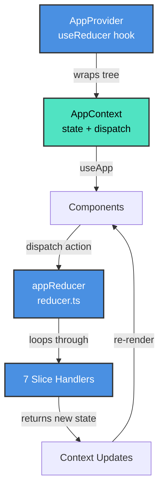
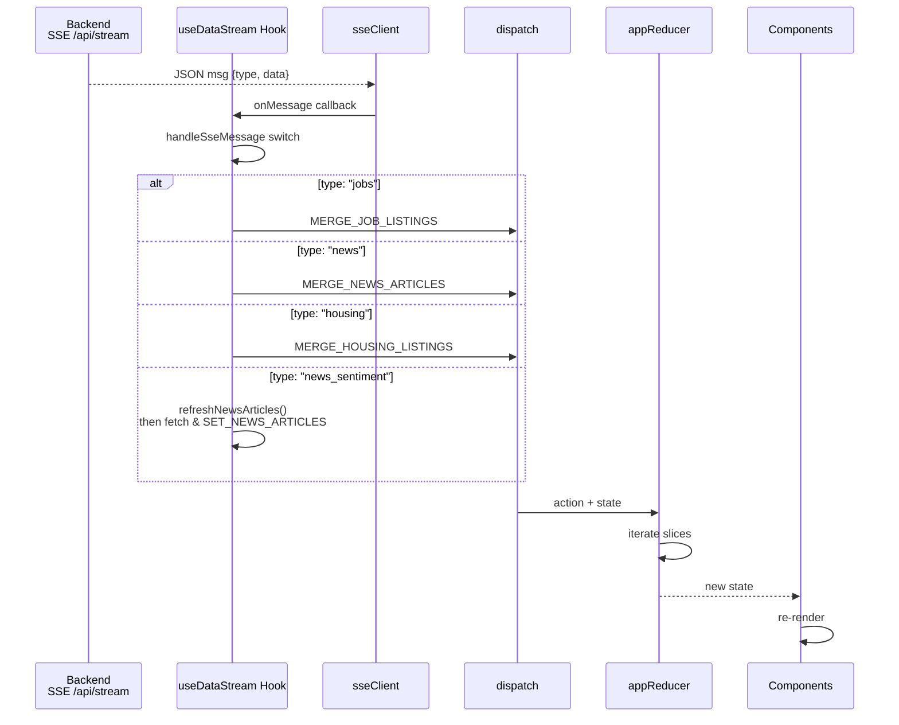
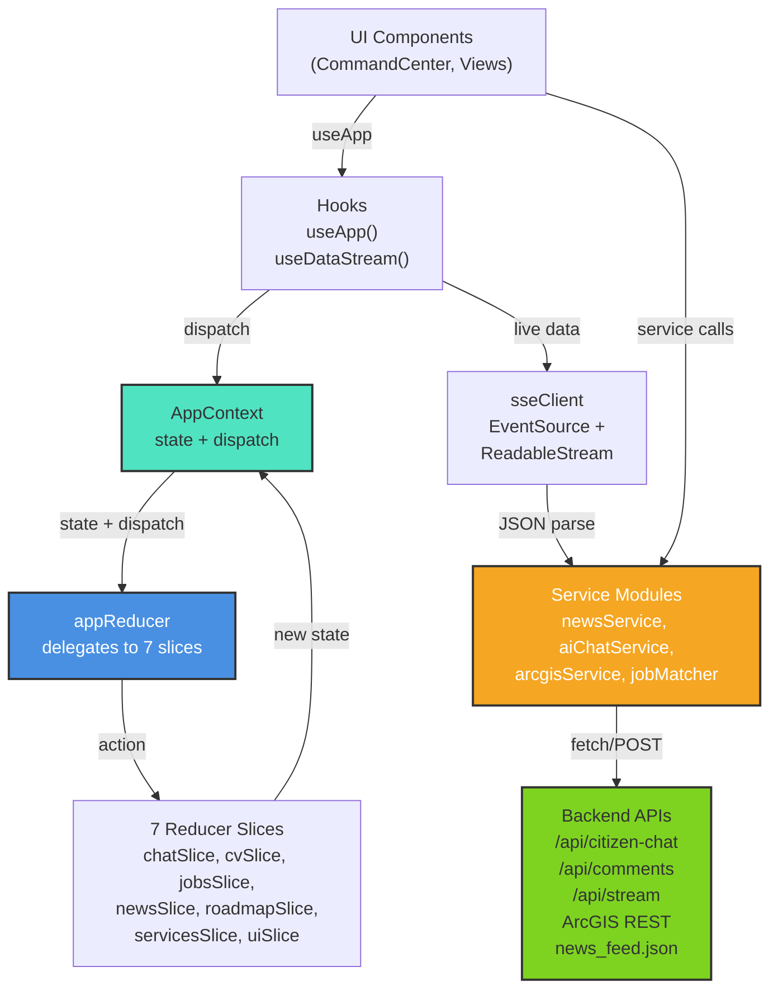

# Frontend Business Logic Layer (`/lib`)

The business logic layer encapsulates state management, API integration, and domain workflows. It decouples UI components from implementation details and provides reusable hooks and services.

## Architecture Overview

The `/lib` folder follows a **layered service architecture**:

- **Context & State**: `appContext.tsx`, `context/reducer.ts`, and seven reducer slices manage global application state.
- **Hooks**: `useDataStream.ts` connects to live backend streams; custom hooks consume context and services.
- **Services**: Domain-specific modules (chat, news, jobs, ArcGIS, SSE) communicate with backend APIs and external services.
- **Utilities**: Helper functions for skill matching, data normalization, and calculations.

## State Management: AppContext + Reducer Pattern

Global state is managed via React Context + useReducer, inspired by Redux but simpler and more maintainable.

### AppProvider & AppContext (appContext.tsx:1-31)

```typescript
export function AppProvider({ children }: { children: ReactNode })
export function useApp(): AppContextValue
```

- `AppProvider` wraps the component tree and provides `state` and `dispatch` to all consumers.
- `useApp()` hook returns the context or throws if called outside AppProvider.
- Manages a single, centralized `AppState` object (defined in `types.ts`).

### State Management Flow



### Reducer Pattern (context/reducer.ts:21-27)

```typescript
export function appReducer(state: AppState, action: AppAction): AppState
```

The main reducer iterates through seven slice handlers. Each slice is responsible for one domain:

1. **chatSlice** — Messages, chat bubble state, typing indicators, action items.
2. **cvSlice** — CV data, file uploads, analysis status.
3. **jobsSlice** — Job listings, matches, trending skills, commute estimates, housing listings.
4. **newsSlice** — News articles, comments, user reactions, misinformation scores.
5. **roadmapSlice** — Active skill development roadmap and completed steps.
6. **servicesSlice** — Service points (map pins), active categories, guide messages, map commands.
7. **uiSlice** — Active view (services, profile, news, admin).

Each slice handler returns `null` if the action doesn't apply to it, allowing the reducer to efficiently delegate.

---

## Reducer Slices: Action Types & Side Effects

### chatSlice.ts:21-60

Handles all chat-related state updates.

**Key Actions**:

| Action | Effect |
|--------|--------|
| `ADD_MESSAGE` | Adds chat message, triggers side effects (flow, profile, action items). |
| `SET_TYPING` | Sets typing indicator for assistant. |
| `TOGGLE_CHAT_BUBBLE` \| `SET_CHAT_BUBBLE_OPEN` | Controls chat bubble visibility. |
| `UPDATE_PROFILE` | Merges profile data from AI responses. |
| `SET_ACTION_ITEMS` \| `TOGGLE_ACTION_ITEM` | Manages task lists. |
| `SET_FLOW` \| `SET_LANGUAGE` | Sets active onboarding flow and language. |
| `ADD_ARTIFACT` \| `SET_ACTIVE_ARTIFACT` | Manages generated code artifacts. |

**Side Effects** (applyMessageSideEffects):
- Extracts `flowMeta` → updates `activeFlow`.
- Extracts `profileData` → merges into user profile.
- Extracts `actionItems` → replaces task list.
- Marks chat bubble as unread if assistant message arrives while closed.

---

### cvSlice.ts:4-17

Manages CV upload and analysis lifecycle.

**Key Actions**:

| Action | Effect |
|--------|--------|
| `SET_CV_DATA` | Stores parsed CV and marks analysis complete. |
| `SET_CV_FILE` | Stores uploaded file name. |
| `SET_CV_ANALYZING` | Sets loading state during analysis. |
| `CLEAR_CV` | Clears all CV state. |

---

### jobsSlice.ts:4-35

Handles job listings, matches, and housing data.

**Key Actions**:

| Action | Effect |
|--------|--------|
| `SET_JOB_LISTINGS` | Replaces all job listings. |
| `MERGE_JOB_LISTINGS` | Appends new listings (deduplicates by ID). |
| `SET_JOB_MATCHES` | Stores job-to-profile matches with score. |
| `SET_TRENDING_SKILLS` | Caches trending skill keywords across jobs. |
| `SET_COMMUTE_ESTIMATES` | Stores transit time estimates. |
| `SET_TRANSIT_ROUTES` | Stores ArcGIS-based route data. |
| `MERGE_HOUSING_LISTINGS` | Appends housing listings (deduplicates by ID). |

**Live Merge Pattern**:
```typescript
// Avoid duplicates when SSE streams new data
const existingIds = new Set(state.jobListings.map((j) => j.id));
const fresh = action.listings.filter((j) => !existingIds.has(j.id));
return { ...state, jobListings: [...fresh, ...state.jobListings] };
```

---

### newsSlice.ts:4-99

Handles articles, comments, reactions, and misinformation flags.

**Key Actions**:

| Action | Effect |
|--------|--------|
| `SET_NEWS_ARTICLES` | Replaces all articles. |
| `MERGE_NEWS_ARTICLES` | Appends new articles (deduplicates by ID). |
| `TOGGLE_ARTICLE_LIKE` | Adds/removes like; increments upvotes. |
| `ADD_NEWS_COMMENT` | Appends comment and increments article comment count. |
| `SET_ARTICLE_REACTION` | Updates reaction counts (e.g., emoji votes). |
| `TOGGLE_ARTICLE_FLAG` | Marks article as flagged for moderation. |
| `UPDATE_MISINFO_SCORES` | Sets misinformation risk scores and reasons. |
| `SET_SELECTED_ARTICLE` | Tracks selected article for detail view. |

---

### roadmapSlice.ts:4-22

Manages skill development roadmaps.

**Key Actions**:

| Action | Effect |
|--------|--------|
| `SET_ACTIVE_ROADMAP` | Sets roadmap and clears completed steps. |
| `CLEAR_ROADMAP` | Removes active roadmap. |
| `TOGGLE_ROADMAP_STEP` | Marks step as completed/incomplete. |

---

### servicesSlice.ts:4-45

Handles service directory, map pins, and guide chat.

**Key Actions**:

| Action | Effect |
|--------|--------|
| `SET_SELECTED_PIN` | Highlights a service point on the map. |
| `TOGGLE_CATEGORY` | Adds/removes category filter. |
| `SET_SERVICE_POINTS` | Replaces service points (fetched from ArcGIS). |
| `ADD_SERVICE_POINTS` | Appends and deduplicates service points. |
| `SET_MAP_COMMAND` | Sets AI-requested map action (e.g., "show health"). |
| `SEND_GUIDE_MESSAGE` | Queues a guide message for processing. |
| `ADD_GUIDE_MESSAGE` | Appends guide message to chat. |

---

### uiSlice.ts:4-11

Minimal UI state.

**Key Actions**:

| Action | Effect |
|--------|--------|
| `SET_VIEW` | Sets active tab (services, profile, news, admin). |

---

## Live Data Streaming: useDataStream Hook

### Overview (useDataStream.ts:52-106)

Connects to the backend SSE stream (`/api/stream`) and dispatches MERGE_* actions as data arrives.

```typescript
export function useDataStream(): void
function handleSseMessage(msg: SseMessage, dispatch): void
```

**Call this once in the root component** (e.g., CommandCenter) to activate live updates.

### Data Flow: SSE → Dispatch → Reducer → Re-render



### Message Type Handling (useDataStream.ts:68-105)

| SSE Type | Payload | Action Dispatched |
|----------|---------|-------------------|
| `jobs` | GeoJSON features → JobListing[] | `MERGE_JOB_LISTINGS` |
| `news` | NewsArticle[] | `MERGE_NEWS_ARTICLES` |
| `housing` | GeoJSON features → HousingListing[] | `MERGE_HOUSING_LISTINGS` |
| `news_sentiment` | (analysis complete) | `refreshNewsArticles()` then `SET_NEWS_ARTICLES` |

---

## SSE Client: Framework-Agnostic Streaming

### sseClient.ts:22-65

Low-level EventSource wrapper with auto-reconnect.

```typescript
export function connectSseStream(options: SseOptions): () => void
export async function readSseStream(url, body, onToken, onToolCall): Promise<string>
```

**connectSseStream**:
- Opens persistent EventSource connection.
- Parses JSON messages.
- Calls `onMessage` for each event.
- Auto-reconnects on error (default 3s delay).
- Returns cleanup function.

**readSseStream**:
- POST-based SSE (fetch + ReadableStream).
- Used for streaming chat responses.
- Calls `onToken` for text chunks.
- Calls `onToolCall` for agent tool invocations.
- Returns full concatenated response.

---

## Service Modules: API Integration

### newsService.ts (News Data)

```typescript
export async function fetchNewsArticles(): Promise<NewsArticle[]>
export async function fetchNewsComments(): Promise<NewsComment[]>
export function sortArticlesByDate(articles): NewsArticle[]
export function filterArticlesByCategory(articles, category): NewsArticle[]
export function formatRelativeTime(dateString): string
```

**Endpoints**:
- `GET /data/news_feed.json` — Fetch articles with deduplication.
- `GET /api/comments` — Fetch user comments.

**Caching**: Single-level cache prevents duplicate fetches during same session.

**Deduplication**: Removes articles with duplicate titles (case-insensitive).

**Date Handling**:
- Parses relative dates ("14 hours ago").
- Falls back to ISO 8601 parsing.
- Formats for display ("Just now", "2d ago").

---

### aiChatService.ts (Conversational AI)

```typescript
export async function sendChatMessage(message, conversationId?): Promise<AiChatResponse | null>
export function aiResponseToChatMessage(ai): ChatMessage
export async function getSmartResponse(message): Promise<ChatMessage>
```

**Endpoint**: `POST /api/citizen-chat`

**Session Tracking**: Maintains `_conversationId` per session for context memory.

**Graceful Fallback**: If backend is down, returns demo responses.

**Response Transformation**:
- Extracts `answer` and `follow_up_question`.
- Maps `map_commands` → MapCommand action.
- Maps `source_items` → ServiceCardData.
- Parses `chips` for quick-action buttons.

---

### arcgisService.ts (Service Directory)

```typescript
export async function fetchServicePoints(category: ServiceCategory): Promise<ServicePoint[]>
export function clearServiceCache(): void
```

**Base URL**: `https://gis.montgomeryal.gov/server/rest/services`

**Categories** (LAYER_CONFIG):
- `health` → Health Care Facilities
- `community` → Community Centers
- `childcare` → Daycare Centers
- `education` → Education Facilities
- `safety` → Fire Stations
- `libraries` → Libraries
- `parks` → Parks
- `police` → Police Facilities

**Features**:
- Per-category layer configuration (field mappings).
- 10-second request timeout.
- Automatic polygon centroid computation for area features.
- Per-category caching.
- Deduplicates invalid/NaN coordinates.

**ServicePoint Structure**:
```typescript
{
  id, category, name, address, lat, lng,
  phone?, hours?, website?, details: Record<string, string>
}
```

---

### jobMatcher.ts (Job-Profile Matching Engine)

```typescript
export function matchJobsToProfile(jobs, cvData): JobMatch[]
export function computeTrendingSkills(jobs): TrendingSkill[]
export function jobMatchesSkillFilter(job, rawSkillKey): boolean
```

**Job Matching Algorithm**:
1. Normalize CV skills (lowercase, trim, dedup).
2. Extract required skills from job posting.
3. Match user skills against requirements (substring matching).
4. Calculate match percentage.
5. Separate matched vs. missing skills.
6. Sort by match percentage (descending).

**Skill Filtering**:
- Prevents false positives (e.g., "rn" from "return" in non-healthcare jobs).
- Healthcare-only skills validated against job title pattern.

**Trending Skills**:
- Aggregates skill occurrences across job market.
- Calculates percentage of jobs requiring each skill.
- Sorted by frequency.

---

## Module Summary Diagram



---

## Key Patterns & Conventions

### 1. Action-Driven State Updates

All state mutations flow through actions. No direct context mutation.

```typescript
dispatch({ type: "SET_VIEW", view: "news" });
dispatch({ type: "MERGE_JOB_LISTINGS", listings });
```

### 2. Live Data Deduplication

When merging SSE data, always deduplicate by ID to prevent duplicates:

```typescript
const existingIds = new Set(state.jobListings.map(j => j.id));
const fresh = action.listings.filter(j => !existingIds.has(j.id));
return { ...state, jobListings: [...fresh, ...state.jobListings] };
```

### 3. Graceful Degradation

Services return `null` or empty arrays on failure, triggering fallbacks:

```typescript
const aiResponse = await sendChatMessage(message);
if (aiResponse) return aiResponseToChatMessage(aiResponse);
return getDemoResponse(message); // Fallback
```

### 4. Per-Domain Slices

Each slice is a pure function: `(state, action) => state | null`.

- No side effects (side effects happen in components via useEffect + hooks).
- Early returns (`null`) allow the reducer to skip irrelevant slices.
- Single responsibility per slice.

### 5. Composition Over Inheritance

Services are stateless utilities. No class inheritance.

```typescript
const articles = await fetchNewsArticles();
const sorted = sortArticlesByDate(articles);
const filtered = filterArticlesByCategory(sorted, "health");
```

---

## File Structure

```
frontend/src/lib/
├── appContext.tsx              # Context provider & useApp hook
├── types.ts                    # AppState, AppAction types
├── useDataStream.ts           # SSE connection & dispatch
├── sseClient.ts               # EventSource + ReadableStream
├── newsService.ts             # News API integration
├── aiChatService.ts           # Chat API & fallback
├── arcgisService.ts           # Service points from ArcGIS
├── jobMatcher.ts              # Job matching engine
├── jobMatcherHelpers.ts       # Skill normalization
├── jobService.ts              # Job listing utilities
├── chatHelpers.ts             # Message builders
├── apiConfig.ts               # API base URL config
├── citizenProfiles.ts         # Mock citizen data loader
├── newsCommentStore.ts        # LocalStorage comment persistence
├── context/
│   ├── reducer.ts             # Main reducer (delegates to slices)
│   ├── types.ts               # AppAction type union
│   ├── initialState.ts        # Default AppState
│   └── slices/
│       ├── chatSlice.ts       # Chat + AI response handling
│       ├── cvSlice.ts         # CV upload & analysis
│       ├── jobsSlice.ts       # Job listings & matches
│       ├── newsSlice.ts       # News articles & reactions
│       ├── roadmapSlice.ts    # Skill roadmaps
│       ├── servicesSlice.ts   # Service directory & map
│       └── uiSlice.ts         # Active view
├── misinfo/                   # Misinformation scoring
├── types/                     # Extended TypeScript interfaces
├── demoResponses/             # Fallback demo data
└── mockJobData/               # Mock job listings for dev
```

---

## Integration Points

### Command Center (CommandCenter.tsx:1-132)

- Calls `useDataStream()` to activate live updates.
- Calls `useApp()` to access state and dispatch.
- Calls `getSmartResponse()` for AI chat.
- Renders active view based on `state.activeView`.

### View Components

- `ServicesView` → reads `state.servicePoints`, `state.activeCategories`.
- `NewsPage` → reads `state.newsArticles`, `state.selectedArticleId`.
- `ProfileView` → reads `state.profile`, `state.cvData`, `state.jobMatches`.

### Floating Chat Bubble

- Subscribes to `state.chatBubbleOpen`, `state.messages`.
- Calls `handleSendMessage()` for user input.
- Auto-updates on `state.chatBubbleHasUnread`.

---

## Performance Considerations

1. **Per-Domain Slices**: Reduce reducer complexity (7 small functions vs. 1 large switch).
2. **Deduplication**: Prevent memory bloat from repeated SSE events.
3. **Caching**: NewsService and arcgisService cache to avoid redundant fetches.
4. **Memoization**: Components wrap with React.memo to prevent unnecessary re-renders.
5. **Lazy Evaluation**: Mapper functions in slices only execute for relevant actions.

---

## Debugging Tips

1. **Log dispatch actions**: Add console.log in the main reducer to trace action flow.
2. **Chrome DevTools**: React DevTools shows context updates and renders.
3. **SSE Debugging**: Check Network tab for `/api/stream` events.
4. **Stale Closures**: useRef in useDataStream prevents stale dispatch references.
5. **Action Types**: All action types defined in context/types.ts as a discriminated union.
